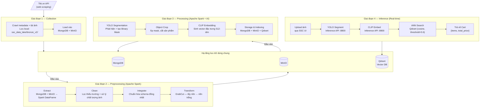
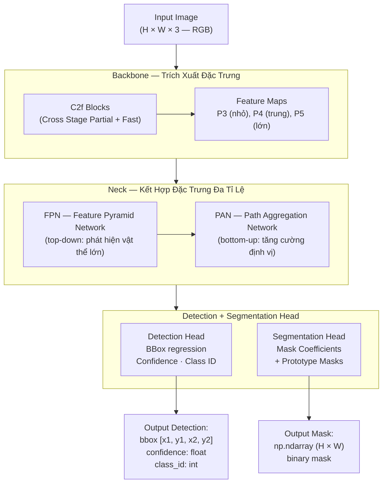
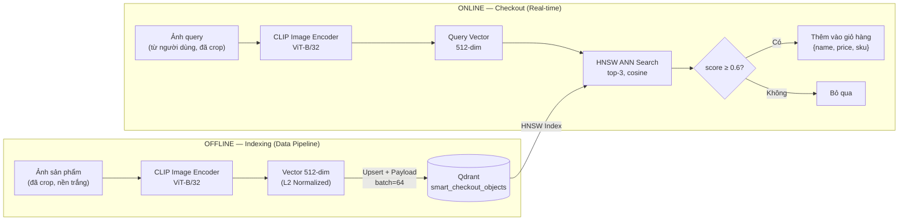
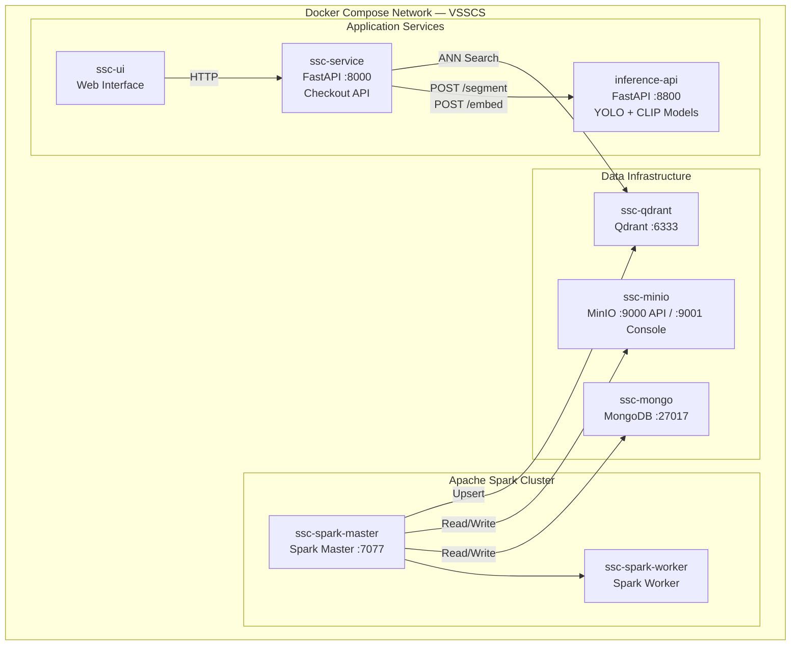
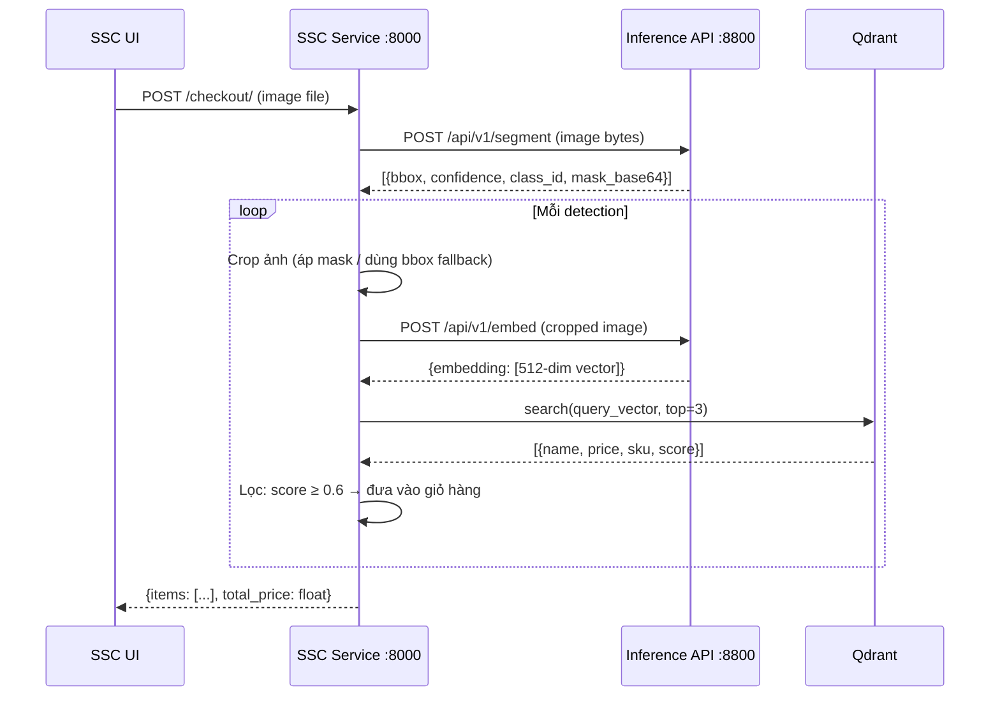

# Báo Cáo Đề Tài
# VSSCS — Vietnam Supermarket Smart Checkout System

---

## 1. Tổng Quan Đề Tài

### 1.1. Đặt Vấn Đề

Trong bối cảnh ngành bán lẻ hiện đại đang chuyển đổi số mạnh mẽ, quy trình thanh toán tại siêu thị vẫn còn phụ thuộc phần lớn vào nhân lực: nhân viên thu ngân phải quét từng mã vạch (barcode) của từng sản phẩm một cách tuần tự. Quy trình này tồn tại nhiều hạn chế rõ ràng. Về khía cạnh hiệu suất vận hành, hiện tượng tắc nghẽn (bottleneck) tại quầy thanh toán gây ra các hàng chờ kéo dài, đặc biệt nghiêm trọng vào giờ cao điểm, ảnh hưởng trực tiếp đến trải nghiệm mua sắm của khách hàng. Về độ chính xác, yếu tố con người luôn tiềm ẩn nguy cơ quét nhầm sản phẩm, bỏ sót mặt hàng hoặc nhập sai số lượng. Về chi phí, việc bố trí số lượng lớn nhân viên thu ngân khiến chi phí nhân sự chiếm tỷ lệ đáng kể trong tổng chi phí vận hành bán lẻ. Về khả năng mở rộng, hệ thống nhận diện bằng mã vạch yêu cầu mỗi sản phẩm phải có nhãn nguyên vẹn — điều kiện dễ bị vi phạm khi nhãn tróc, mờ hoặc mất trong quá trình lưu thông hàng hóa.

Sự phát triển của **Computer Vision** (thị giác máy tính) và **Deep Learning** trong những năm gần đây đã mở ra hướng tiếp cận hoàn toàn mới cho bài toán này. Thay vì quét barcode, hệ thống hoàn toàn có thể **nhìn** và **hiểu** sản phẩm thông qua ảnh chụp, từ đó tự động nhận diện và định giá mà không cần sự can thiệp của nhân sự.

---

### 1.2. Giới Thiệu Đề Tài

**VSSCS — Vietnam Supermarket Smart Checkout System** (Hệ thống Thanh Toán Thông Minh cho Siêu Thị Việt Nam) là một hệ thống tích hợp toàn diện, được xây dựng nhằm giải quyết bài toán nhận diện hàng hóa tự động tại điểm thanh toán. Hệ thống được thiết kế theo hướng **data-driven**: trước tiên thu thập tập dữ liệu ảnh sản phẩm ở quy mô lớn, xây dựng kho vector đặc trưng, sau đó triển khai dịch vụ tra cứu thời gian thực dựa trên sự tương đồng hình ảnh.

Thay vì quét barcode thủ công, người dùng chỉ cần **tải lên một bức ảnh** sản phẩm. Hệ thống sẽ tự động thực hiện ba bước liên tiếp: (1) **phát hiện và phân vùng** từng sản phẩm trong ảnh bằng mô hình Instance Segmentation (YOLO); (2) **trích xuất đặc trưng** hình ảnh bằng mô hình Embedding (CLIP) và so sánh với cơ sở dữ liệu vector; (3) **tra cứu và tổng hợp** tên sản phẩm cùng giá tiền, trả về giỏ hàng hoàn chỉnh và tổng số tiền trong thời gian thực.

---

### 1.3. Mục Tiêu Đề Tài

| Mục tiêu | Mô tả |
|---|---|
| **Thu thập dữ liệu quy mô lớn** | Xây dựng bộ dữ liệu hình ảnh sản phẩm đa dạng từ nền tảng thương mại điện tử Việt Nam (Tiki.vn) thông qua web scraping |
| **Xây dựng Data Pipeline hoàn chỉnh** | Thiết kế hệ thống ETL đa giai đoạn (Collection → Preprocessing → Processing), xử lý dữ liệu quy mô lớn bằng Apache Spark |
| **Ứng dụng AI nhận diện sản phẩm** | Kết hợp Instance Segmentation (YOLO) và Feature Embedding (CLIP/ResNet50) để nhận diện sản phẩm qua hình ảnh |
| **Lập chỉ mục và tra cứu tương đồng** | Xây dựng Vector Database (Qdrant) lưu trữ đặc trưng ảnh, phục vụ Approximate Nearest Neighbor Search thời gian thực |
| **Triển khai dịch vụ end-to-end** | Cung cấp Inference API (FastAPI, cổng 8800), Checkout API (FastAPI, cổng 8000) và giao diện web (SSC UI) |

---

### 1.4. Phạm Vi Đề Tài

Hệ thống thu thập dữ liệu từ **Tiki.vn** — một trong những nền tảng thương mại điện tử lớn nhất Việt Nam — thông qua web scraping và gọi API công khai. Phạm vi bao phủ **15 danh mục sản phẩm lớn** được xác định trong `crawler.py`, trải dài từ thực phẩm đến điện tử tiêu dùng:

| STT | Danh mục | ID Tiki |
|---|---|---|
| 1 | Bách Hóa Online - Thực Phẩm | 4384 |
| 2 | Nhà Cửa - Đời Sống | 1883 |
| 3 | Làm Đẹp - Sức Khỏe | 1520 |
| 4 | Sách, VPP & Quà Tặng | 8322 |
| 5 | Điện thoại - Máy tính bảng | 1789 |
| 6 | Thiết bị số - Phụ kiện số | 1815 |
| 7 | Điện Gia Dụng | 1882 |
| 8 | Đồ Chơi - Mẹ & Bé | 2549 |
| 9 | Ô Tô - Xe Máy - Xe Đạp | 8594 |
| 10 | Thời trang nữ | 931 |
| 11 | Thời trang nam | 915 |
| 12 | Laptop - Máy Vi Tính - Linh kiện | 1846 |
| 13 | Điện Tử - Điện Lạnh | 4221 |
| 14 | Giày - Dép nữ | 1703 |
| 15 | Giày - Dép nam | 1686 |

Quy mô mục tiêu được thiết lập ở mức 9.000 – 11.000 sản phẩm trên mỗi leaf category (nhóm danh mục nhỏ nhất, không có danh mục con), bao gồm đầy đủ metadata (tên, giá, SKU, platform) và ảnh sản phẩm tương ứng. Về giới hạn kỹ thuật, hệ thống hiện xử lý ảnh **đơn sản phẩm (single-object image)** — mỗi ảnh chứa một sản phẩm chính — phù hợp với đặc điểm ảnh thu thập từ trang thương mại điện tử.

---

### 1.5. Kiến Trúc Tổng Thể Hệ Thống

Hệ thống VSSCS được tổ chức theo mô hình **phân tầng** (layered architecture) gồm 4 phân hệ chức năng kết nối qua hạ tầng lưu trữ dùng chung. Luồng dữ liệu được thiết kế rõ ràng theo hai pha: pha **offline** (batch processing) bao gồm Collection, Preprocessing và Processing để xây dựng kho tri thức; pha **online** (real-time inference) bao gồm SSC Service và SSC UI để phục vụ người dùng tại điểm thanh toán.

**Sơ đồ 1 — Kiến trúc hệ thống và luồng dữ liệu tổng quan:**



---

### 1.6. Công Nghệ Sử Dụng (Tech Stack)

| Lớp | Công nghệ | Phiên bản | Vai trò |
|---|---|---|---|
| **Thu thập dữ liệu** | Python · `requests` · BeautifulSoup4 | — | Crawl Tiki API, scrape HTML, tải ảnh |
| **Xử lý dữ liệu phân tán** | Apache Spark (PySpark) | — | Xử lý dữ liệu song song quy mô lớn |
| **Xử lý ảnh** | OpenCV (headless) · Pillow | `4.9.0.80` · `10.3.0` | Làm sạch ảnh, tẩy nền (GrabCut), resize, encode |
| **Object Segmentation** | Ultralytics YOLO | `8.1.47` | Instance Segmentation — phát hiện và phân vùng vật thể |
| **Feature Extraction** | CLIP (`openai/clip-vit-base-patch32`) · ResNet50 | `transformers 4.39.3` · `torchvision 0.17.2` | Trích xuất vector đặc trưng 512-dim / 2048-dim |
| **Deep Learning Runtime** | PyTorch | `2.2.2` | Backend tính toán tensor cho CLIP và ResNet50 |
| **Vector Database** | Qdrant | — | Lưu trữ và tìm kiếm tương đồng vector (ANN Search) |
| **Document Database** | MongoDB | — | Lưu metadata sản phẩm và trạng thái pipeline |
| **Object Storage** | MinIO (S3-compatible) | — | Lưu trữ ảnh nhị phân theo từng giai đoạn pipeline |
| **Backend API** | FastAPI · Uvicorn | `0.110.1` · `0.29.0` | Inference API (:8800) và Checkout API (:8000) |
| **Frontend** | HTML · CSS · JavaScript (Vanilla) | — | Giao diện web upload ảnh, hiển thị giỏ hàng |
| **Containerization** | Docker · Docker Compose | — | Đóng gói và điều phối toàn bộ microservices |

---

## 2. Cơ Sở Lý Thuyết

Phần này trình bày nền tảng lý thuyết của các công nghệ cốt lõi trong hệ thống VSSCS, được tổ chức theo trật tự từ tầng dữ liệu đến tầng AI và tầng hạ tầng triển khai.

---

### 2.1. Data Pipeline và Mô Hình ETL

#### 2.1.1. Khái Niệm ETL

**ETL (Extract – Transform – Load)** là quy trình chuẩn trong kỹ thuật dữ liệu (Data Engineering), mô tả ba bước cốt lõi để đưa dữ liệu từ nguồn thô đến hệ thống đích ở trạng thái có thể khai thác. Giai đoạn **Extract** thực hiện trích xuất dữ liệu thô từ các nguồn khác nhau — trong VSSCS, đây là quá trình crawl Tiki API và đọc dữ liệu từ MongoDB, MinIO thông qua Spark Connector. Giai đoạn **Transform** bao gồm toàn bộ các thao tác làm sạch, lọc lỗi, chuẩn hóa định dạng và biến đổi nội dung — cụ thể là lọc metadata thiếu trường, xử lý chất lượng ảnh, chuẩn hóa schema, tẩy nền bằng GrabCut và trích xuất đặc trưng bằng YOLO cùng CLIP. Giai đoạn **Load** là bước lưu trữ dữ liệu đã xử lý vào hệ thống đích — insert vào MongoDB, upload ảnh lên MinIO và upsert vector vào Qdrant.

| Giai đoạn | Mô tả chung | Thực thi trong VSSCS |
|---|---|---|
| **Extract** | Trích xuất dữ liệu thô từ các nguồn | Crawl Tiki API; đọc MongoDB và MinIO qua Spark Connector |
| **Transform** | Làm sạch, lọc lỗi, chuẩn hóa định dạng, biến đổi nội dung | Lọc metadata thiếu trường; xử lý chất lượng ảnh; chuẩn hóa schema; tẩy nền GrabCut; trích xuất đặc trưng YOLO + CLIP |
| **Load** | Lưu trữ dữ liệu đã xử lý vào hệ thống đích | Insert vào MongoDB; upload ảnh lên MinIO; upsert vector vào Qdrant |

#### 2.1.2. Multi-Stage Pipeline — Pipeline Đa Tầng

Trong hệ thống xử lý dữ liệu lớn, ETL thường được tổ chức thành nhiều tầng nối tiếp (**Multi-Stage Pipeline**), trong đó đầu ra của tầng trước là đầu vào của tầng sau. Mỗi tầng lưu kết quả trung gian ra hệ thống lưu trữ bền vững, nhờ đó đảm bảo được ba tính chất then chốt.

Thứ nhất là **Fault Tolerance** (khả năng chịu lỗi): khi pipeline gặp sự cố ở bất kỳ tầng nào, hệ thống có thể khởi động lại từ chính tầng đó mà không phải tính toán lại từ đầu, vì kết quả của các tầng trước đã được lưu trữ ổn định. Thứ hai là **Data Lineage** (truy vết nguồn gốc dữ liệu): toàn bộ trạng thái dữ liệu sau mỗi bước xử lý đều được lưu với đường dẫn MinIO riêng biệt và collection MongoDB độc lập, phục vụ quá trình kiểm tra, debug và audit khi cần thiết. Thứ ba là **Separation of Concerns** (tách biệt trách nhiệm): mỗi tầng chỉ đảm nhiệm một nhiệm vụ duy nhất, giúp hệ thống dễ bảo trì, kiểm thử và mở rộng từng phần độc lập.

VSSCS triển khai mô hình pipeline 3 tầng xử lý chính: **Collection → Preprocessing → Processing**, với dữ liệu trung gian được lưu trữ trong MongoDB và MinIO sau mỗi tầng.

---

### 2.2. Xử Lý Dữ Liệu Phân Tán — Apache Spark

#### 2.2.1. Tổng Quan Apache Spark

**Apache Spark** là framework xử lý dữ liệu phân tán mã nguồn mở, được thiết kế để xử lý tập dữ liệu lớn (Big Data) bằng cách phân chia công việc ra nhiều **executor** chạy song song trên cụm máy chủ (cluster). So với Hadoop MapReduce truyền thống, Spark đạt tốc độ nhanh hơn nhiều bậc nhờ vào cơ chế xử lý dữ liệu **trong bộ nhớ RAM** (in-memory computing), thay vì đọc và ghi đĩa liên tục sau mỗi bước trung gian. **PySpark** là API Python của Apache Spark, cho phép định nghĩa và thực thi các pipeline xử lý dữ liệu quy mô lớn bằng ngôn ngữ Python.

#### 2.2.2. Lazy Evaluation và DAG

Đặc điểm cốt lõi và quan trọng nhất của Spark là cơ chế **Lazy Evaluation (Tính toán lười)**. Khi lập trình viên gọi các **Transformation** như `filter()`, `withColumn()`, `join()` hay `map()`, Spark không thực thi ngay lập tức mà chỉ ghi nhận thao tác đó vào một **DAG (Directed Acyclic Graph)** — đồ thị có hướng không có chu trình, biểu diễn toàn bộ kế hoạch thực thi. Spark chỉ thực sự kích hoạt tính toán khi gặp một **Action** cụ thể như `count()`, `collect()`, `write()` hay `show()`. Nhờ cơ chế này, Spark có thể **tối ưu hóa toàn bộ kế hoạch thực thi** trước khi chạy: loại bỏ các bước thừa, đẩy phép lọc xuống sớm nhất có thể (predicate pushdown), đồng thời gộp nhiều phép biến đổi liên tiếp thành một giai đoạn thực thi duy nhất.

#### 2.2.3. Các Khái Niệm Cơ Bản

| Khái niệm | Mô tả |
|---|---|
| **RDD** (Resilient Distributed Dataset) | Cấu trúc dữ liệu phân tán cơ bản — tập hợp phần tử bất biến, chia thành nhiều partition, có khả năng phục hồi khi xảy ra lỗi |
| **DataFrame** | RDD có cấu trúc schema rõ ràng (giống bảng SQL), tích hợp query optimizer Catalyst, cung cấp API bậc cao hơn |
| **Partition** | Một phần dữ liệu của RDD/DataFrame được xử lý độc lập trên một executor core — đơn vị song song hóa cơ bản của Spark |

#### 2.2.4. mapPartitions — Tối Ưu Cho Tác Vụ Nặng

Thay vì áp một hàm lên từng hàng đơn lẻ như `map()`, **`mapPartitions()`** áp hàm lên **toàn bộ một partition** (một iterator bao gồm nhiều hàng). Cách tiếp cận này mang lại lợi thế đáng kể trong các tác vụ nặng: tài nguyên tốn kém như model AI, MinIO client hay Qdrant client chỉ cần được khởi tạo **một lần duy nhất mỗi partition**, thay vì phải khởi tạo lại cho từng hàng dữ liệu. Bên cạnh đó, việc kết hợp `ThreadPoolExecutor` bên trong `mapPartitions` cho phép xử lý các hàng trong cùng một partition một cách song song, đặc biệt hiệu quả khi tác vụ chủ yếu là I/O như gọi HTTP API hay tải ảnh từ MinIO. Trong VSSCS, toàn bộ pipeline AI bao gồm YOLO segmentation, object crop và CLIP embedding đều được triển khai qua `mapPartitions` kết hợp với `ThreadPoolExecutor(max_workers=2)` trên mỗi partition.

#### 2.2.5. Caching — Ngắt Chuỗi DAG

Khi pipeline phải xử lý dữ liệu ảnh nhị phân nặng, nếu không áp dụng caching, mỗi **Action** tiếp theo sẽ buộc Spark phải tính toán lại toàn bộ DAG từ điểm gốc — bao gồm cả việc tải lại ảnh từ MinIO và xử lý lại bằng OpenCV. Để tránh điều này, sau khi thực thi một Action đầu tiên, DataFrame được giữ nguyên trong bộ nhớ thông qua lệnh `df.cache()`. Các Action tiếp theo sẽ đọc trực tiếp từ RAM mà không cần tái thực thi DAG. Khi dữ liệu không còn cần thiết, lệnh `df.unpersist()` được gọi để giải phóng bộ nhớ.

```python
df.cache()      # Lưu trữ DataFrame vào RAM
df.count()      # Action ép Spark thực thi DAG và giữ kết quả
# Mọi Action tiếp theo đọc từ RAM, không tính lại DAG
df.unpersist()  # Giải phóng RAM khi không còn cần
```

---

### 2.3. Xử Lý Ảnh (Image Processing)

#### 2.3.1. Các Vấn Đề Chất Lượng Ảnh Thực Tế

Ảnh sản phẩm thu thập từ web thường gặp nhiều vấn đề chất lượng ảnh hưởng trực tiếp đến độ chính xác của vector embedding. Bốn nhóm vấn đề chính được hệ thống xác định và xử lý:

| Vấn đề | Biểu hiện | Ảnh hưởng đến AI |
|---|---|---|
| **Mờ (Blur)** | Ảnh thiếu nét, cạnh bị nhòe | Model khó trích xuất đặc trưng hình dạng và texture |
| **Nhiễu hạt (Noise)** | Hạt nhiễu trên bề mặt ảnh, hay gặp ở ảnh chụp thiếu sáng | Vector embedding bị nhiễu, giảm độ chính xác similarity search |
| **Chói sáng (Overexposure)** | Vùng sáng quá mức, mất chi tiết | Mất thông tin màu sắc và texture bề mặt sản phẩm |
| **Nền phức tạp (Complex Background)** | Hậu cảnh lộn xộn, tay người, đạo cụ bán hàng | Model học nhầm đặc trưng background, gây sai lệch similarity search |

#### 2.3.2. Sharpening — Làm Sắc Nét Ảnh Mờ

Hệ thống phát hiện độ mờ bằng **Laplacian Variance**: tích chập toán tử Laplacian lên ảnh xám rồi tính phương sai của kết quả. Phương sai thấp hơn ngưỡng 100 đồng nghĩa với ảnh thiếu nét và cần được xử lý. Để tăng độ nét, ảnh được tích chập với một **Sharpening Kernel** 3×3:

```
K = [[-1, -1, -1],
     [-1,  9, -1],
     [-1, -1, -1]]
```

Kernel này khuếch đại các thành phần tần số cao (high-frequency components) bằng cách lấy 9 lần giá trị pixel trung tâm trừ đi tổng các pixel lân cận, từ đó làm sắc nét chi tiết và cạnh vật thể trong ảnh.

#### 2.3.3. Median Blur — Khử Nhiễu Bảo Toàn Cạnh

**Median Blur** thay thế mỗi pixel bằng **giá trị trung vị (median)** của các pixel trong cửa sổ k×k lân cận, với k=3 trong VSSCS. Khác với Gaussian Blur vốn sử dụng giá trị trung bình và có xu hướng làm mờ cả các cạnh đối tượng, Median Blur **giữ được cạnh sắc nét** trong khi vẫn loại bỏ nhiễu hạt một cách hiệu quả. Đây là kỹ thuật đặc biệt phù hợp với dạng nhiễu salt-and-pepper thường gặp trong ảnh sản phẩm chụp điều kiện thiếu sáng.

#### 2.3.4. CLAHE — Cân Bằng Độ Tương Phản Thích Nghi

**CLAHE (Contrast Limited Adaptive Histogram Equalization)** là phiên bản cải tiến của Histogram Equalization thông thường, khắc phục hai nhược điểm chính của phương pháp gốc. Tính **Adaptive** (thích nghi) được thể hiện ở chỗ ảnh được chia thành các **tile** nhỏ (8×8 trong VSSCS) và histogram equalization được thực hiện cục bộ cho từng tile, nhờ đó xử lý tốt hơn các ảnh có phân bố độ sáng không đồng đều. Tính **Contrast Limited** đến từ tham số `clipLimit` (bằng 2.0 trong VSSCS), giúp giới hạn biên độ khuếch đại histogram tại mỗi bin và tránh tình trạng nhiễu bị phóng đại quá mức. Đặc biệt, CLAHE chỉ được áp dụng trên **kênh L (Lightness)** của không gian màu **CIE LAB**, đảm bảo rằng chỉ độ sáng bị điều chỉnh trong khi màu sắc thực của sản phẩm được giữ nguyên hoàn toàn.

```
RGB → Chuyển sang CIE LAB → Áp CLAHE lên kênh L → Chuyển về RGB
```

#### 2.3.5. GrabCut — Tẩy Nền Ảnh

**GrabCut** (Rother, Kolmogorov, Blake — Microsoft Research, SIGGRAPH 2004) là thuật toán phân đoạn ảnh kết hợp hai kỹ thuật nền tảng. **Gaussian Mixture Model (GMM)** đóng vai trò là mô hình xác suất để phân biệt màu sắc và texture của foreground (sản phẩm) và background (nền ảnh), được cập nhật và tinh chỉnh qua nhiều vòng lặp. **Graph Cut (Min-cut/Max-flow)** biểu diễn ảnh như một đồ thị có trọng số — mỗi pixel là một nút, các cạnh nối pixel lân cận mang trọng số phản ánh xác suất thuộc foreground hoặc background được ước lượng từ GMM. Bài toán phân đoạn khi đó được quy về bài toán **Min-Cut** — tìm tập cắt có tổng trọng số nhỏ nhất để tách foreground khỏi background.

Quy trình GrabCut trong VSSCS được thực hiện theo 5 bước tuần tự. Hệ thống xác định **ROI (Region of Interest)** bằng 90% diện tích ảnh trung tâm với padding 5% mỗi cạnh, dựa trên giả định rằng sản phẩm chính luôn nằm trong vùng này. Tiếp theo, GrabCut xây dựng GMM riêng cho foreground và background dựa trên ROI đã xác định. Graph Cut sau đó phân loại từng pixel vào một trong bốn trạng thái: `GC_BGD` (background chắc chắn), `GC_FGD` (foreground chắc chắn), `GC_PR_BGD` hoặc `GC_PR_FGD` (xác suất). Quá trình này được lặp lại 5 lần để đạt hội tụ. Cuối cùng, tất cả pixel có `mask == 0` hoặc `mask == 2` (background) được tô màu trắng (RGB = 255, 255, 255), tạo ra ảnh sản phẩm trên nền trắng đồng nhất.

Lý do kỹ thuật của bước tẩy nền là để ngăn chặn model embedding học và so sánh cả các đặc trưng của background. Nếu hai sản phẩm khác nhau nhưng có cùng background tương tự, vector embedding của chúng có thể gần nhau một cách sai lệch. Nền trắng đồng nhất buộc model tập trung hoàn toàn vào hình thái, màu sắc và kết cấu bề mặt của sản phẩm.

---

### 2.4. Instance Segmentation — Phân Vùng Đối Tượng

#### 2.4.1. Phân Loại Các Bài Toán Nhận Diện Đối Tượng

Trong Computer Vision, có bốn bậc bài toán liên quan đến nhận diện đối tượng với mức độ chi tiết tăng dần theo từng cấp độ:

| Bài toán | Đầu ra | Phân biệt từng thực thể | Mức độ chi tiết |
|---|---|---|---|
| **Image Classification** | Nhãn lớp của toàn bộ ảnh | Không | Thấp nhất |
| **Object Detection** | Bounding Box + nhãn lớp cho từng vật thể | Có | Trung bình |
| **Semantic Segmentation** | Mask pixel theo lớp (không phân biệt từng thực thể) | Không | Cao |
| **Instance Segmentation** | Mask pixel riêng biệt cho **từng thực thể** | Có | Cao nhất |

Trong VSSCS, **Instance Segmentation** là bắt buộc vì khi một ảnh chứa nhiều sản phẩm, hệ thống cần biết chính xác pixel nào thuộc về từng sản phẩm cụ thể để tách riêng và nhận diện độc lập.

#### 2.4.2. YOLO — You Only Look Once

**YOLO (You Only Look Once)** là họ mô hình object detection được thiết kế đặc biệt cho **xử lý thời gian thực**. Điểm khác biệt cốt lõi của YOLO so với các kiến trúc 2-stage truyền thống như Faster R-CNN là khả năng xử lý toàn bộ ảnh trong **một lần forward pass** duy nhất qua mạng neural, thay vì phải trải qua hai giai đoạn riêng biệt (Region Proposal → Classification), nhờ đó đạt tốc độ suy luận (inference) rất cao.

**Sơ đồ 2 — Kiến trúc YOLO Segmentation:**



Kiến trúc YOLO hiện đại (YOLOv8/YOLO11) gồm ba thành phần chính. **Backbone** sử dụng các khối C2f (Cross Stage Partial with 2 convolutions fast) để trích xuất đặc trưng (feature maps) ở nhiều tỉ lệ khác nhau từ ảnh đầu vào, cân bằng giữa tốc độ và độ chính xác. **Neck** kết hợp Feature Pyramid Network (FPN) theo hướng top-down để phát hiện tốt cả vật thể lớn lẫn nhỏ, và Path Aggregation Network (PAN) theo hướng bottom-up để tăng cường khả năng định vị chính xác vị trí. **Head** bao gồm Detection Head dự đoán bounding box, confidence score và class_id; song song đó là Segmentation Head dự đoán mask coefficients kết hợp prototype masks để tạo ra polygon mask nhị phân (H×W) cho từng vật thể được phát hiện.

Dự án sử dụng hai phiên bản mô hình: `yolov8x-seg.pt` được nạp trong Inference API server (`api_server.py`, dòng 16) — phiên bản lớn nhất với độ chính xác cao nhất; và `yolo11n-seg.pt` có sẵn trong repository — phiên bản nhỏ gọn phù hợp cho Spark local mode.

Sau khi YOLO phát hiện vật thể, hệ thống thực hiện cơ chế crop như sau: nếu mask được cung cấp, binary mask được áp lên ảnh gốc để tô trắng toàn bộ vùng background ngoài mask, sau đó crop theo Bounding Box để tách sản phẩm (`mask_applied=True`); nếu không có mask, hệ thống fallback sang crop thẳng theo Bounding Box (`mask_applied=False`). Hệ thống chỉ giữ lại **object có confidence score cao nhất** sau khi sắp xếp giảm dần, vì mỗi ảnh sản phẩm chỉ chứa một sản phẩm chính.

---

### 2.5. Feature Embedding — Trích Xuất Đặc Trưng Hình Ảnh

#### 2.5.1. Khái Niệm Embedding

**Embedding** (hay Feature Vector) là quá trình **mã hóa dữ liệu phi cấu trúc** như ảnh, văn bản hay âm thanh thành một **vector số thực nhiều chiều** trong không gian toán học liên tục. Nguyên lý cơ bản của embedding là: các đối tượng có **ngữ nghĩa giống nhau** sẽ được ánh xạ thành các vector **gần nhau** trong không gian (góc nhỏ, khoảng cách nhỏ), trong khi các đối tượng **ngữ nghĩa khác nhau** sẽ tạo ra các vector **xa nhau**. Nhờ đặc tính này, bài toán "tìm sản phẩm có ảnh giống nhất" được quy về bài toán **tìm vector gần nhất (Nearest Neighbor Search)** — có thể giải hiệu quả bằng các cấu trúc dữ liệu và thuật toán chuyên biệt.

#### 2.5.2. CLIP — Contrastive Language-Image Pretraining

**CLIP** (Radford et al., OpenAI, ICML 2021) là mô hình nền tảng (foundation model) được huấn luyện trên **400 triệu cặp (ảnh, văn bản)** thu thập từ internet theo phương pháp **Contrastive Learning**. Trong quá trình huấn luyện, mỗi cặp đúng gồm ảnh và văn bản mô tả tương ứng được đưa vào tối ưu để embedding của chúng **gần nhau** trong không gian vector chung, trong khi các cặp sai (ảnh của sản phẩm này ghép với văn bản của sản phẩm khác) được tối ưu để embedding **xa nhau**. Hàm mất mát được sử dụng là **InfoNCE Loss** — một dạng symmetric cross-entropy trên ma trận similarity giữa toàn bộ cặp trong batch.

CLIP bao gồm hai encoder riêng biệt: **Image Encoder** (Vision Transformer — ViT) và **Text Encoder** (Transformer). Trong VSSCS, **chỉ sử dụng Image Encoder** để biến đổi ảnh sản phẩm thành vector 512 chiều. Cụ thể, ảnh đầu vào được chia thành các **patch 32×32 pixel** — mỗi patch đóng vai trò như một "token" (tương tự từ trong xử lý ngôn ngữ tự nhiên). Các patch được flatten, ghép Position Embedding để mã hóa thông tin vị trí, rồi đưa qua các lớp **Multi-Head Self-Attention** của Transformer. Token đặc biệt `[CLS]` ở đầu chuỗi tổng hợp thông tin toàn cục của ảnh và được dùng làm image embedding 512 chiều. Trước khi lưu vào Qdrant, vector được **L2 Normalize** (chia cho norm L2) để tương thích với metric Cosine Similarity.

CLIP là lựa chọn phù hợp cho bài toán nhận diện sản phẩm vì ba lý do: mô hình học được đặc trưng **ngữ nghĩa cao** giúp phân biệt sản phẩm theo hình dạng, màu sắc, texture và ngữ cảnh thương mại; khả năng **zero-shot generalization** cho phép hoạt động tốt trên ảnh sản phẩm mới mà không cần fine-tuning thêm; và tập dữ liệu huấn luyện cực kỳ đa dạng giúp mô hình tổng quát hóa tốt trên nhiều loại sản phẩm.

#### 2.5.3. ResNet50 — Phương Án Dự Phòng (Fallback)

**ResNet (Residual Network)** (He, Zhang, Ren, Sun — Microsoft Research, arXiv 2015 / CVPR 2016) giải quyết vấn đề **Vanishing Gradient** trong mạng neural sâu bằng cơ chế **Skip Connection (kết nối tắt)**. Thay vì buộc mạng phải học hàm `H(x)` trực tiếp, cơ chế này để mạng chỉ cần học **phần dư** `F(x) = H(x) − x`, với đầu ra cuối cùng là `F(x) + x`. Gradient có thể lan truyền trực tiếp qua skip connection mà không bị triệt tiêu, cho phép huấn luyện hiệu quả các mạng rất sâu (50, 101, 152 lớp).

```
Thông thường:    Output = F(x)
ResNet:          Output = F(x) + x
```

Trong VSSCS, ResNet50 được tải từ `torchvision.models.resnet50(pretrained=True)`, lớp **Fully Connected cuối cùng bị loại bỏ**, để lấy feature vector **2048 chiều** từ đầu ra của lớp convolution cuối (average pooled). Ảnh đầu vào được resize về 224×224 và normalize theo thống kê ImageNet (mean=[0.485, 0.456, 0.406], std=[0.229, 0.224, 0.225]). ResNet50 được dùng như phương án dự phòng khi thư viện `transformers` cần thiết cho CLIP không khả dụng.

---

### 2.6. Vector Database và Tìm Kiếm Tương Đồng

#### 2.6.1. Vector Database là gì?

**Vector Database** là hệ thống cơ sở dữ liệu được tối ưu hóa chuyên biệt để **lưu trữ và tra cứu** các vector nhiều chiều. Điểm khác biệt cốt lõi so với CSDL quan hệ truyền thống nằm ở kiểu truy vấn: trong khi SQL tìm kiếm chính xác theo điều kiện filter, Vector Database thực hiện **Similarity Search** — tìm các vector gần nhất với vector truy vấn theo một metric khoảng cách.

| Tiêu chí | CSDL Quan hệ (SQL) | Vector Database |
|---|---|---|
| Đơn vị lưu trữ | Hàng (row) theo schema cố định | Vector (float array) + Payload (metadata) |
| Kiểu truy vấn | Tìm kiếm chính xác theo điều kiện filter | Tìm kiếm tương đồng (similarity search) theo khoảng cách vector |
| Phù hợp với | Dữ liệu có cấu trúc, truy vấn filter chính xác | Dữ liệu phi cấu trúc (ảnh, văn bản) đã được embedding |
| Thuật toán index | B-tree, Hash Index | HNSW, IVF, PQ và các thuật toán ANN |

#### 2.6.2. Cosine Similarity

Trong không gian vector, **Cosine Similarity** đo mức độ tương đồng dựa trên **góc** giữa hai vector, không phụ thuộc vào độ lớn (magnitude) của chúng:

$$\text{cosine\_similarity}(\mathbf{A}, \mathbf{B}) = \frac{\mathbf{A} \cdot \mathbf{B}}{|\mathbf{A}| \cdot |\mathbf{B}|} = \frac{\sum_{i=1}^{n} A_i B_i}{\sqrt{\sum_{i=1}^{n} A_i^2} \cdot \sqrt{\sum_{i=1}^{n} B_i^2}}$$

Kết quả nằm trong khoảng [-1, +1], trong đó +1 nghĩa là hai vector hoàn toàn cùng chiều (tương đồng tối đa), 0 nghĩa là vuông góc (không liên quan), và -1 nghĩa là hoàn toàn trái chiều. Khi vector đã được **L2 Normalize** (|**A**| = |**B**| = 1), Cosine Similarity tương đương với phép tính **Dot Product**, giúp tăng tốc độ tính toán đáng kể. Trong VSSCS, ngưỡng được thiết lập tại `score ≥ 0.6` để xác định sản phẩm khớp (xác minh từ `checkout.py`, dòng 56); các kết quả có điểm thấp hơn ngưỡng này bị loại bỏ. Lý do ưu tiên Cosine thay vì Euclidean Distance là vì Cosine không bị ảnh hưởng bởi độ lớn tuyệt đối của vector — điều quan trọng khi **hướng** của vector đặc trưng mang nhiều ngữ nghĩa hơn độ dài của nó.

#### 2.6.3. Approximate Nearest Neighbor (ANN) Search

**Exact Nearest Neighbor Search** — tức duyệt toàn bộ tập vector để tìm kết quả chính xác — có độ phức tạp O(N·d), không khả thi khi N lên đến hàng triệu vector và d lên đến vài trăm chiều. **ANN Search** (Approximate Nearest Neighbor) là nhóm thuật toán chấp nhận sai số nhỏ trong kết quả để đổi lấy tốc độ tìm kiếm cực cao.

**HNSW (Hierarchical Navigable Small World Graph)** (Malkov & Yashunin, 2018) là thuật toán ANN mà Qdrant sử dụng. HNSW xây dựng một **đồ thị phân cấp nhiều lớp**: các lớp trên cùng thưa hơn với ít nút và các kết nối tầm xa, trong khi lớp thấp nhất chứa toàn bộ vector với các kết nối cục bộ dày đặc. Khi tìm kiếm, thuật toán bắt đầu từ lớp cao nhất và thực hiện greedy walk đến láng giềng gần nhất, sau đó dần xuống lớp thấp hơn để thu hẹp vùng tìm kiếm. Độ phức tạp tìm kiếm trung bình đạt **O(log N)** thay vì O(N·d) của brute-force, đủ hiệu quả để phục vụ hàng triệu vector trong thời gian thực.

#### 2.6.4. Qdrant — Hệ Thống Vector Database Được Sử Dụng

**Qdrant** là Vector Database mã nguồn mở hiệu suất cao, được viết bằng ngôn ngữ Rust, đảm bảo an toàn bộ nhớ và hiệu năng tối ưu. Các khái niệm cốt lõi của Qdrant được áp dụng trong VSSCS:

| Khái niệm | Mô tả | Giá trị trong VSSCS |
|---|---|---|
| **Collection** | Nhóm các Point cùng kích thước vector và metric khoảng cách | `smart_checkout_objects` (512-dim, COSINE) |
| **Point** | Đơn vị lưu trữ cơ bản: `{id, vector, payload}` | Mỗi object sản phẩm đã crop = 1 point |
| **Vector** | Mảng số thực (float) biểu diễn đặc trưng | CLIP embedding 512-dim, L2-normalized |
| **Payload** | Metadata đi kèm, được trả về khi search | `{sku, name, price, platform, minio_image_path, minio_object_path, bbox}` |
| **Upsert** | Insert hoặc Update — thao tác idempotent | Batch 64 points/lần (xác minh từ `data_processing.py`, dòng 198) |

**Sơ đồ 3 — Quy trình Embedding + Vector Search:**



---

### 2.7. Hạ Tầng Lưu Trữ và Triển Khai

#### 2.7.1. MongoDB — Document Database

**MongoDB** là hệ quản trị cơ sở dữ liệu NoSQL hướng tài liệu (Document-Oriented DBMS). Mỗi bản ghi được lưu dưới dạng **BSON document** (Binary JSON) với cấu trúc linh hoạt, không yêu cầu schema cố định trước. MongoDB được lựa chọn trong VSSCS vì hai lý do kỹ thuật chính. Thứ nhất, dữ liệu sản phẩm thu thập từ Tiki rất **đa dạng về schema** — sản phẩm điện thoại, thực phẩm và quần áo có tập trường thông tin hoàn toàn khác nhau — MongoDB xử lý tốt điều này mà không cần cấu hình schema cứng nhắc. Thứ hai, MongoDB cung cấp **MongoDB Spark Connector** (`org.mongodb.spark:mongo-spark-connector_2.13:10.4.0`) cho phép đọc và ghi DataFrame phân tán trực tiếp từ các Spark job trong pipeline.

Cấu trúc lưu trữ MongoDB trong VSSCS theo từng giai đoạn pipeline (xác minh từ toàn bộ source code):

| Database | Collection | Dữ liệu lưu trữ |
|---|---|---|
| `smart_checkout` | `products` | Metadata thô từ Tiki crawler |
| `preprocessing` | `cleaning` | Metadata + đường dẫn MinIO sau bước Clean |
| `preprocessing` | `integrated` | Metadata + đường dẫn MinIO sau bước Integrate |
| `preprocessing` | `transformed` | Metadata + đường dẫn MinIO sau bước Transform → đầu vào của Processing |
| `processing` | `objects` | Metadata object đã crop: `{sku, name, price, bbox, embedding, minio_image_path, minio_object_path}` |

Một điểm quan trọng cần lưu ý: toàn bộ dữ liệu ảnh nhị phân (`image_data`) được **loại bỏ** (`.drop("image_data")`) trước khi ghi vào MongoDB — chỉ lưu metadata và đường dẫn tham chiếu đến MinIO. Dữ liệu ảnh binary thực sự được lưu trữ hoàn toàn trên MinIO.

#### 2.7.2. MinIO — Object Storage

**MinIO** là hệ thống lưu trữ đối tượng (Object Storage) mã nguồn mở, tương thích hoàn toàn với **Amazon S3 API**. Dữ liệu được tổ chức theo mô hình phẳng: `Bucket → Object (Key → Binary Value)`. Lý do tách lưu trữ ảnh ra khỏi MongoDB xuất phát từ nguyên tắc thiết kế: lưu blob nhị phân lớn trực tiếp trong MongoDB sẽ làm tăng kích thước document và gây chậm trễ cho các truy vấn metadata vốn không cần đến ảnh. MinIO được tối ưu đặc biệt cho streaming file lớn với hỗ trợ multipart upload, chunked download và presigned URL. Đây là best practice phổ biến trong các hệ thống xử lý đa phương tiện quy mô lớn: tách biệt metadata (MongoDB) và binary data (MinIO).

Cấu trúc lưu trữ MinIO trong VSSCS theo từng giai đoạn (xác minh từ source code):

| Bucket | Object Path Pattern | Giai đoạn |
|---|---|---|
| `products-images` | `{filename}.jpg` | Collection — ảnh thô từ Tiki |
| `smart-checkout` | `preprocessing/clean/{id}.jpg` | Preprocessing — sau bước Clean |
| `smart-checkout` | `preprocessing/integrate/{id}.jpg` | Preprocessing — sau bước Integrate |
| `smart-checkout` | `preprocessing/transform/{id}.jpg` | Preprocessing — sau bước Transform |
| `smart-checkout` | `processing/objects/{sku}/{sub_id}.jpg` | Processing — ảnh crop sản phẩm cuối cùng |

#### 2.7.3. Kiến Trúc Microservices và Docker

**Microservices** là kiến trúc phần mềm trong đó ứng dụng được phân rã thành các **service nhỏ, độc lập** — mỗi service đảm nhiệm một chức năng duy nhất và giao tiếp với nhau qua REST API. Ưu điểm của kiến trúc này là mỗi service có thể được deploy, cập nhật và scale một cách độc lập; sự cố tại một service không kéo theo sự sụp đổ của toàn hệ thống.

**Docker** đóng gói mỗi service vào một **container** độc lập bao gồm đầy đủ code, runtime, thư viện và cấu hình, đảm bảo môi trường chạy nhất quán trên mọi hạ tầng từ máy phát triển đến môi trường sản xuất. **Docker Compose** điều phối nhiều container thông qua một file cấu hình YAML duy nhất, thiết lập mạng nội bộ, volume và dependency giữa các service.

**Sơ đồ 4 — Hạ tầng Docker Compose:**



File `kafka-docker-compose.yml` đã được chuẩn bị sẵn trong repository dưới dạng cấu hình dự phòng. Trong thiết kế mở rộng, Apache Kafka có thể đóng vai trò như một Message Queue đặt giữa các Spark job và inference workers, cho phép scale horizontal bằng cách thêm nhiều GPU worker mà không cần thay đổi kiến trúc tổng thể của hệ thống.

**Sơ đồ 5 — Luồng Inference API khi Checkout:**



---

*Tài liệu được biên soạn và xác minh trực tiếp từ source code của repository `smart-checkout` — VSSCS project. Tất cả thông số kỹ thuật bao gồm cổng kết nối, ngưỡng similarity, batch size, tên model, tên collection, chiều embedding và cấu trúc đường dẫn đều được lấy từ code thực tế, không suy đoán.*
