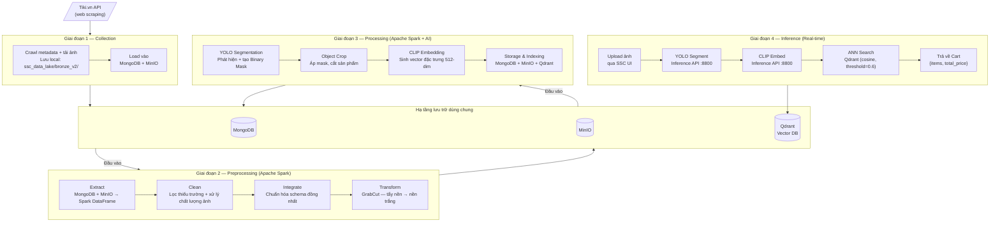
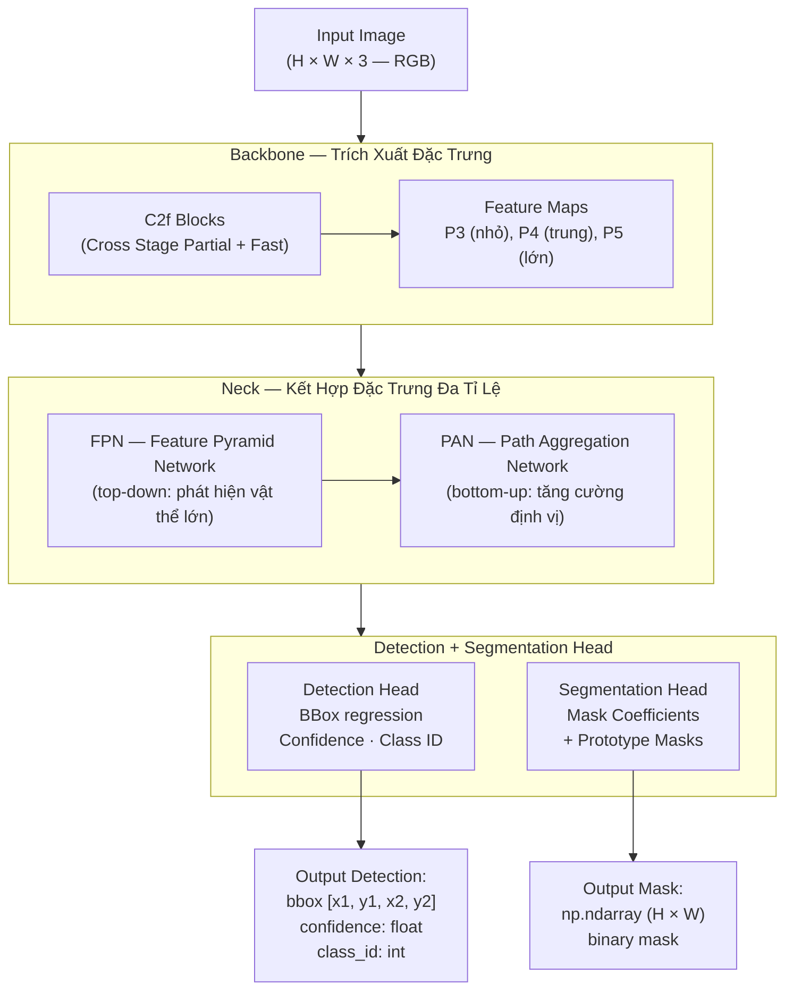
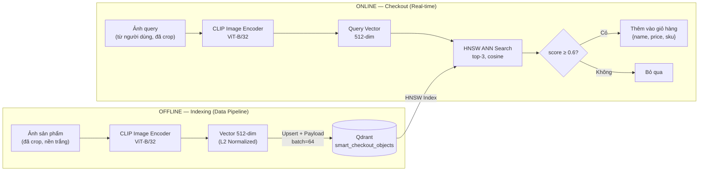
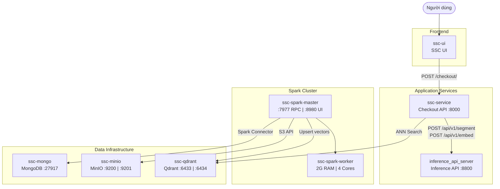
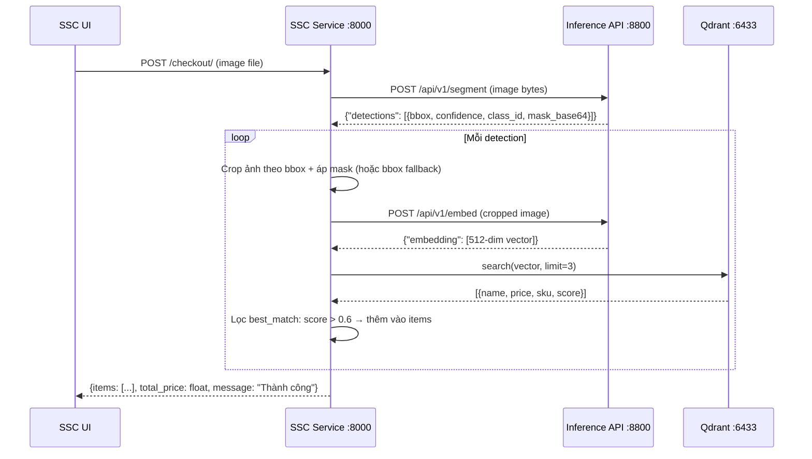

# Báo Cáo Đề Tài
# VSSCS — Vietnam Supermarket Smart Checkout System

---

## 1. Tổng Quan Đề Tài

### 1.1. Đặt Vấn Đề

Trong bối cảnh ngành bán lẻ hiện đại đang trải qua làn sóng chuyển đổi số mạnh mẽ, quy trình thanh toán tại siêu thị vẫn còn phụ thuộc phần lớn vào nhân lực theo cách thức truyền thống: nhân viên thu ngân phải quét từng mã vạch (barcode) của từng sản phẩm một cách tuần tự, thủ công. Quy trình này tồn tại nhiều hạn chế mang tính hệ thống. Về hiệu suất vận hành, hiện tượng tắc nghẽn (bottleneck) tại quầy thanh toán phát sinh thường xuyên, tạo ra hàng chờ kéo dài đặc biệt vào giờ cao điểm, ảnh hưởng trực tiếp đến trải nghiệm mua sắm và mức độ hài lòng của khách hàng. Về độ chính xác, yếu tố chủ quan của con người luôn tiềm ẩn nguy cơ quét nhầm sản phẩm, bỏ sót mặt hàng hoặc nhập sai số lượng — những lỗi mà hệ thống điện tử hoàn toàn có thể loại bỏ. Về chi phí vận hành, việc bố trí một lực lượng lớn nhân viên thu ngân khiến chi phí nhân sự chiếm tỷ lệ đáng kể trong tổng cơ cấu chi phí bán lẻ. Về khả năng mở rộng, hệ thống nhận diện dựa trên mã vạch yêu cầu nghiêm ngặt mỗi sản phẩm phải có nhãn nguyên vẹn — điều kiện dễ bị vi phạm khi nhãn bị tróc, mờ hoặc mất trong quá trình lưu thông hàng hóa, dẫn đến gián đoạn vận hành.

Sự phát triển vượt bậc của **Computer Vision** (thị giác máy tính) và **Deep Learning** trong những năm gần đây đã mở ra một hướng tiếp cận hoàn toàn mới, có tiềm năng giải quyết triệt để những hạn chế nêu trên. Thay vì phụ thuộc vào mã vạch, hệ thống có thể được trang bị khả năng **nhìn** và **hiểu** sản phẩm thông qua hình ảnh thị giác, từ đó tự động nhận diện, phân loại và định giá mà không cần sự can thiệp trực tiếp của nhân sự.

---

### 1.2. Giới Thiệu Đề Tài

**VSSCS — Vietnam Supermarket Smart Checkout System** (Hệ thống Thanh Toán Thông Minh cho Siêu Thị Việt Nam) là một hệ thống tích hợp toàn diện, được xây dựng nhằm giải quyết bài toán nhận diện hàng hóa tự động tại điểm thanh toán theo hướng tiếp cận dựa trên hình ảnh. Hệ thống được thiết kế theo triết lý **data-driven**: trước tiên xây dựng một tập dữ liệu ảnh sản phẩm ở quy mô lớn thông qua thu thập từ nền tảng thương mại điện tử, sau đó tiến hành làm sạch, chuẩn hóa và trích xuất đặc trưng để hình thành kho vector tri thức, và cuối cùng triển khai dịch vụ tra cứu tương đồng theo thời gian thực phục vụ tại điểm thanh toán.

Thay vì quét mã vạch thủ công, người dùng chỉ cần tải lên một bức ảnh của nhóm sản phẩm cần thanh toán, và hệ thống sẽ lần lượt thực hiện ba bước xử lý liên tiếp để hoàn tất việc nhận diện. Trước tiên, hệ thống tiến hành **phát hiện và phân vùng** từng sản phẩm xuất hiện trong ảnh bằng mô hình Instance Segmentation (YOLO), qua đó tách riêng từng vật thể thành một ảnh độc lập. Tiếp theo, mỗi ảnh sản phẩm đã được tách riêng sẽ được đưa qua bước **trích xuất đặc trưng** bằng mô hình Embedding (CLIP), rồi thực hiện tìm kiếm tương đồng bằng cách so sánh với cơ sở dữ liệu vector đã được lập chỉ mục từ trước. Sau cùng, hệ thống thực hiện **tra cứu, tổng hợp** kết quả và trả về giỏ hàng hoàn chỉnh, bao gồm tên sản phẩm, giá tiền của từng mặt hàng và tổng số tiền cần thanh toán — toàn bộ quá trình này diễn ra trong thời gian thực.

---

### 1.3. Mục Tiêu Đề Tài

Đề tài VSSCS hướng đến việc hiện thực hóa năm mục tiêu cụ thể, được trình bày tóm tắt trong bảng sau:

| Mục tiêu | Mô tả |
|---|---|
| **Thu thập dữ liệu quy mô lớn** | Xây dựng bộ dữ liệu hình ảnh sản phẩm đa dạng từ nền tảng thương mại điện tử Việt Nam (Tiki.vn) thông qua web scraping tự động |
| **Xây dựng Data Pipeline hoàn chỉnh** | Thiết kế hệ thống ETL đa giai đoạn (Collection → Preprocessing → Processing), xử lý dữ liệu quy mô lớn bằng Apache Spark |
| **Ứng dụng AI nhận diện sản phẩm** | Kết hợp Instance Segmentation (YOLO) và Feature Embedding (CLIP/ResNet50) để nhận diện sản phẩm qua hình ảnh |
| **Lập chỉ mục và tra cứu tương đồng** | Xây dựng Vector Database (Qdrant) lưu trữ đặc trưng ảnh, phục vụ Approximate Nearest Neighbor Search thời gian thực |
| **Triển khai dịch vụ end-to-end** | Cung cấp Inference API (FastAPI, cổng 8800), Checkout API (FastAPI, cổng 8000) và giao diện web tương tác (SSC UI) |

---

### 1.4. Phạm Vi Đề Tài

Hệ thống thu thập dữ liệu từ **Tiki.vn** — một trong những nền tảng thương mại điện tử lớn nhất Việt Nam — thông qua web scraping tự động kết hợp gọi API công khai của nền tảng. Phạm vi đề tài bao phủ **15 danh mục sản phẩm lớn**, trải rộng từ nhóm thực phẩm tiêu dùng đến điện tử, thời trang và đồ gia dụng, được liệt kê chi tiết trong bảng sau:

| STT | Danh mục | ID Tiki |
|---|---|---|
| 1 | Bách Hóa Online - Thực Phẩm | 4384 |
| 2 | Nhà Cửa - Đời Sống | 1883 |
| 3 | Làm Đẹp - Sức Khỏe | 1520 |
| 4 | Sách, VPP & Quà Tặng | 8322 |
| 5 | Điện thoại - Máy tính bảng | 1789 |
| 6 | Thiết bị số - Phụ kiện số | 1815 |
| 7 | Điện Gia Dụng | 1882 |
| 8 | Đồ Chơi - Mẹ & Bé | 2549 |
| 9 | Ô Tô - Xe Máy - Xe Đạp | 8594 |
| 10 | Thời trang nữ | 931 |
| 11 | Thời trang nam | 915 |
| 12 | Laptop - Máy Vi Tính - Linh kiện | 1846 |
| 13 | Điện Tử - Điện Lạnh | 4221 |
| 14 | Giày - Dép nữ | 1703 |
| 15 | Giày - Dép nam | 1686 |

Quy mô thu thập được thiết lập mục tiêu ở mức 9.000 – 11.000 sản phẩm trên mỗi leaf category (nhóm danh mục nhỏ nhất, không còn danh mục con bên dưới), đảm bảo mỗi sản phẩm đi kèm đầy đủ metadata (tên, giá, SKU, platform) và ảnh sản phẩm chất lượng cao. Về giới hạn kỹ thuật của phiên bản hiện tại, hệ thống được tối ưu hóa để xử lý ảnh **đơn sản phẩm (single-object image)** — mỗi ảnh chứa một sản phẩm chính — phù hợp với đặc điểm ảnh đại diện thu thập từ các trang liệt kê sản phẩm trên nền tảng thương mại điện tử.

---

### 1.5. Kiến Trúc Tổng Thể Hệ Thống

Hệ thống VSSCS được tổ chức theo mô hình **phân tầng** (layered architecture), bao gồm 4 phân hệ chức năng kết nối và chia sẻ dữ liệu thông qua một hạ tầng lưu trữ dùng chung. Toàn bộ luồng vận hành được phân chia thành hai pha riêng biệt: pha **offline** (batch processing) diễn ra trước khi triển khai, bao gồm ba giai đoạn Collection, Preprocessing và Processing, có nhiệm vụ xây dựng kho tri thức vector đặc trưng sản phẩm; pha **online** (real-time inference) diễn ra khi hệ thống đi vào vận hành thực tế, bao gồm SSC Service và SSC UI, phục vụ người dùng tại điểm thanh toán với thời gian phản hồi tức thì.

**Sơ đồ 1 — Kiến trúc hệ thống và luồng dữ liệu tổng quan:**



---

### 1.6. Công Nghệ Sử Dụng (Tech Stack)

Về mặt công nghệ, hệ thống VSSCS được xây dựng trên một tập hợp công cụ và framework đa dạng, tương ứng với từng lớp chức năng trong kiến trúc tổng thể. Bảng dưới đây tổng hợp các công nghệ chủ đạo được sử dụng xuyên suốt hệ thống:

| Lớp | Công nghệ | Phiên bản | Vai trò |
|---|---|---|---|
| **Thu thập dữ liệu** | Python · `requests` · BeautifulSoup4 | — | Crawl Tiki API, scrape HTML, tải ảnh |
| **Xử lý dữ liệu phân tán** | Apache Spark (PySpark) | — | Xử lý dữ liệu song song quy mô lớn |
| **Xử lý ảnh** | OpenCV (headless) · Pillow | `4.9.0.80` · `10.3.0` | Làm sạch ảnh, tẩy nền (GrabCut), resize, encode |
| **Object Segmentation** | Ultralytics YOLO | `8.1.47` | Instance Segmentation — phát hiện và phân vùng vật thể |
| **Feature Extraction** | CLIP (`openai/clip-vit-base-patch32`) · ResNet50 | `transformers 4.39.3` · `torchvision 0.17.2` | Trích xuất vector đặc trưng 512-dim / 2048-dim |
| **Deep Learning Runtime** | PyTorch | `2.2.2` | Backend tính toán tensor cho CLIP và ResNet50 |
| **Vector Database** | Qdrant | — | Lưu trữ và tìm kiếm tương đồng vector (ANN Search) |
| **Document Database** | MongoDB | — | Lưu metadata sản phẩm và trạng thái pipeline |
| **Object Storage** | MinIO (S3-compatible) | — | Lưu trữ ảnh nhị phân theo từng giai đoạn pipeline |
| **Backend API** | FastAPI · Uvicorn | `0.110.1` · `0.29.0` | Inference API (:8800) và Checkout API (:8000) |
| **Frontend** | HTML · CSS · JavaScript (Vanilla) | — | Giao diện web upload ảnh, hiển thị giỏ hàng |
| **Containerization** | Docker · Docker Compose | — | Đóng gói và điều phối toàn bộ microservices |

---

## 2. Cơ Sở Lý Thuyết

Phần này trình bày nền tảng lý thuyết của các công nghệ cốt lõi cấu thành hệ thống VSSCS, được tổ chức theo trật tự logic từ tầng dữ liệu, qua tầng xử lý phân tán và xử lý ảnh, đến tầng mô hình AI, tầng tìm kiếm vector và cuối cùng là tầng hạ tầng triển khai.

---

### 2.1. Data Pipeline và Mô Hình ETL

#### 2.1.1. Khái Niệm ETL

**ETL (Extract – Transform – Load)** là quy trình chuẩn trong kỹ thuật dữ liệu (Data Engineering), mô tả ba bước cốt lõi để đưa dữ liệu từ nguồn thô đến hệ thống đích ở trạng thái có thể khai thác cho mục đích phân tích hay phục vụ ứng dụng. Giai đoạn **Extract** đảm nhiệm việc trích xuất dữ liệu thô từ các nguồn khác nhau mà không làm thay đổi nội dung — trong ngữ cảnh VSSCS, đây là quá trình thu thập metadata và ảnh sản phẩm từ Tiki API, song song với việc đọc dữ liệu đã lưu trữ từ MongoDB và MinIO thông qua Spark Connector. Giai đoạn **Transform** bao gồm toàn bộ các thao tác làm sạch, lọc lỗi, chuẩn hóa định dạng và biến đổi nội dung nhằm nâng cao chất lượng dữ liệu — cụ thể là lọc các bản ghi metadata thiếu trường bắt buộc, xử lý chất lượng ảnh, chuẩn hóa schema đồng nhất, tẩy nền bằng GrabCut và trích xuất đặc trưng bằng YOLO cùng CLIP. Giai đoạn **Load** là bước cuối cùng, lưu trữ dữ liệu đã được xử lý vào hệ thống đích — ghi metadata vào MongoDB, tải ảnh nhị phân lên MinIO và upsert vector đặc trưng vào Qdrant. Bảng sau tóm tắt ba giai đoạn này:

| Giai đoạn | Mô tả chung | Thực thi trong VSSCS |
|---|---|---|
| **Extract** | Trích xuất dữ liệu thô từ các nguồn | Crawl Tiki API; đọc MongoDB và MinIO qua Spark Connector |
| **Transform** | Làm sạch, lọc lỗi, chuẩn hóa, biến đổi nội dung | Lọc metadata thiếu trường; xử lý chất lượng ảnh; chuẩn hóa schema; tẩy nền GrabCut; trích xuất đặc trưng YOLO + CLIP |
| **Load** | Lưu trữ dữ liệu đã xử lý vào hệ thống đích | Ghi vào MongoDB; upload ảnh lên MinIO; upsert vector vào Qdrant |

#### 2.1.2. Multi-Stage Pipeline — Pipeline Đa Tầng

Trong hệ thống xử lý dữ liệu quy mô lớn, ETL thường được tổ chức thành nhiều tầng nối tiếp, mô hình được gọi là **Multi-Stage Pipeline**, trong đó đầu ra của tầng trước đóng vai trò đầu vào của tầng sau. Mỗi tầng lưu kết quả trung gian ra hệ thống lưu trữ bền vững, nhờ đó đảm bảo được ba tính chất then chốt trong kỹ thuật dữ liệu hiện đại.

Tính chất thứ nhất là **Fault Tolerance** (khả năng chịu lỗi): khi pipeline gặp sự cố ở bất kỳ tầng nào, hệ thống có thể khởi động lại từ chính tầng gặp lỗi mà không phải tính toán lại từ điểm xuất phát, vì toàn bộ kết quả của các tầng đã hoàn thành trước đó đã được lưu trữ bền vững trong MongoDB và MinIO. Tính chất thứ hai là **Data Lineage** (truy vết nguồn gốc dữ liệu): toàn bộ trạng thái dữ liệu sau mỗi bước xử lý đều được ghi lại với đường dẫn MinIO riêng biệt và collection MongoDB độc lập tương ứng, tạo thành dấu vết có thể truy vết đầy đủ — phục vụ quá trình kiểm tra chất lượng, debug khi có sự cố và audit hệ thống. Tính chất thứ ba là **Separation of Concerns** (tách biệt trách nhiệm): mỗi tầng trong pipeline chỉ đảm nhiệm duy nhất một nhiệm vụ được xác định rõ ràng, giúp hệ thống dễ bảo trì, kiểm thử độc lập từng tầng và mở rộng quy mô khi cần.

VSSCS triển khai mô hình pipeline 3 tầng xử lý chính: **Collection → Preprocessing → Processing**, với dữ liệu trung gian được lưu trữ có kiểm soát trong MongoDB và MinIO sau mỗi tầng, trước khi tiến vào giai đoạn tiếp theo.

---

### 2.2. Xử Lý Dữ Liệu Phân Tán — Apache Spark

#### 2.2.1. Tổng Quan Apache Spark

**Apache Spark** là framework xử lý dữ liệu phân tán mã nguồn mở, được thiết kế để xử lý tập dữ liệu lớn (Big Data) bằng cách phân chia khối lượng công việc ra nhiều **executor** hoạt động song song trên cụm máy chủ (cluster). So với Hadoop MapReduce truyền thống, Spark đạt tốc độ nhanh hơn nhiều bậc nhờ vào cơ chế xử lý dữ liệu **trong bộ nhớ RAM** (in-memory computing), thay vì đọc và ghi dữ liệu ra đĩa liên tục sau mỗi bước trung gian — vốn là điểm nghẽn hiệu suất chính của MapReduce. **PySpark** là API Python của Apache Spark, cho phép định nghĩa và thực thi các pipeline xử lý dữ liệu quy mô lớn bằng ngôn ngữ Python một cách tự nhiên.

#### 2.2.2. Lazy Evaluation và DAG

Đặc điểm cốt lõi và quan trọng nhất tạo nên sức mạnh tối ưu hóa của Spark là cơ chế **Lazy Evaluation (Tính toán lười)**. Cụ thể, khi lập trình viên gọi các phép biến đổi **Transformation** như `filter()`, `withColumn()`, `join()` hay `map()`, Spark không thực thi ngay lập tức mà chỉ ghi nhận thao tác đó vào một **DAG (Directed Acyclic Graph)** — đồ thị có hướng không có chu trình, biểu diễn toàn bộ kế hoạch thực thi theo dạng cây phụ thuộc. Cơ chế này chỉ kích hoạt tính toán thực sự khi gặp một **Action** cụ thể như `count()`, `collect()`, `write()` hay `show()`. Nhờ nắm giữ toàn bộ kế hoạch tính toán trước khi thực thi, Spark có thể **tối ưu hóa toàn diện** quy trình xử lý: loại bỏ các bước tính toán thừa, đẩy phép lọc xuống càng sớm càng tốt trong chuỗi thực thi (predicate pushdown) và gộp nhiều phép biến đổi liên tiếp thành một giai đoạn thực thi duy nhất, giảm thiểu số lần đọc ghi bộ nhớ.

#### 2.2.3. Các Khái Niệm Cơ Bản

Bên cạnh khái niệm DAG và Action, một số khái niệm nền tảng khác của Spark cũng cần được làm rõ, được tóm tắt trong bảng sau:

| Khái niệm | Mô tả |
|---|---|
| **RDD** (Resilient Distributed Dataset) | Cấu trúc dữ liệu phân tán cơ bản — tập hợp phần tử bất biến, chia thành nhiều partition, có khả năng tự phục hồi khi executor gặp lỗi |
| **DataFrame** | RDD có cấu trúc schema rõ ràng (tương tự bảng SQL), tích hợp query optimizer Catalyst, cung cấp API bậc cao hơn và hiệu năng tốt hơn |
| **Partition** | Một phân vùng dữ liệu của RDD/DataFrame được xử lý độc lập trên một executor core — đây là đơn vị song song hóa cơ bản của Spark |

#### 2.2.4. mapPartitions — Tối Ưu Cho Tác Vụ Nặng

Thay vì áp một hàm lên từng hàng đơn lẻ theo cách của `map()`, **`mapPartitions()`** áp hàm lên **toàn bộ một partition** — tức một iterator bao gồm nhiều hàng dữ liệu liên tiếp thuộc cùng một phân vùng. Cách tiếp cận này mang lại lợi thế đáng kể trong các tác vụ đòi hỏi tài nguyên khởi tạo nặng: các đối tượng tốn kém như model AI, MinIO client hay Qdrant client chỉ cần được khởi tạo **một lần duy nhất cho mỗi partition**, thay vì phải khởi tạo và giải phóng lại cho từng hàng dữ liệu — giúp giảm thiểu đáng kể overhead khởi tạo. Hơn nữa, việc kết hợp `ThreadPoolExecutor` bên trong hàm `mapPartitions` cho phép xử lý nhiều hàng trong cùng một partition một cách song song theo mô hình đa luồng, đặc biệt hiệu quả khi tác vụ chủ yếu là I/O như gọi HTTP API hay tải ảnh từ MinIO. Trong VSSCS, toàn bộ pipeline AI bao gồm YOLO segmentation, object crop và CLIP embedding đều được triển khai thông qua `mapPartitions` kết hợp với `ThreadPoolExecutor(max_workers=2)` trên mỗi partition.

#### 2.2.5. Caching — Ngắt Chuỗi DAG

Khi pipeline phải xử lý dữ liệu ảnh nhị phân nặng qua nhiều bước, nếu không áp dụng caching, mỗi **Action** tiếp theo sẽ buộc Spark phải tính toán lại toàn bộ DAG từ điểm gốc — bao gồm cả việc tải lại ảnh từ MinIO và xử lý lại bằng OpenCV — gây lãng phí tài nguyên nghiêm trọng. Để khắc phục điều này, sau khi thực thi Action đầu tiên, DataFrame được giữ nguyên trong bộ nhớ thông qua lệnh `df.cache()`, và một Action như `df.count()` được gọi ngay để ép Spark thực thi DAG và lưu kết quả vào RAM. Mọi Action tiếp theo sẽ đọc trực tiếp từ RAM mà không tái thực thi DAG. Khi dữ liệu không còn cần thiết, lệnh `df.unpersist()` được gọi để giải phóng bộ nhớ cho các bước xử lý tiếp theo.

```python
df.cache()      # Lưu trữ DataFrame vào RAM
df.count()      # Action ép Spark thực thi DAG và giữ kết quả
# Mọi Action tiếp theo đọc từ RAM, không tính lại DAG
df.unpersist()  # Giải phóng RAM khi không còn cần
```

---

### 2.3. Xử Lý Ảnh (Image Processing)

#### 2.3.1. Các Vấn Đề Chất Lượng Ảnh Thực Tế

Ảnh sản phẩm thu thập từ web thường gặp nhiều vấn đề chất lượng ảnh hưởng trực tiếp đến độ chính xác của vector embedding, được hệ thống xác định và xử lý có hệ thống trong giai đoạn Preprocessing. Bốn nhóm vấn đề chính được tổng hợp trong bảng sau:

| Vấn đề | Biểu hiện | Ảnh hưởng đến AI |
|---|---|---|
| **Mờ (Blur)** | Ảnh thiếu nét, cạnh bị nhòe | Model khó trích xuất đặc trưng hình dạng và texture |
| **Nhiễu hạt (Noise)** | Hạt nhiễu trên bề mặt ảnh, hay gặp ở ảnh chụp thiếu sáng | Vector embedding bị nhiễu, giảm độ chính xác similarity search |
| **Chói sáng (Overexposure)** | Vùng sáng quá mức, mất chi tiết | Mất thông tin màu sắc và texture bề mặt sản phẩm |
| **Nền phức tạp (Complex Background)** | Hậu cảnh lộn xộn, tay người, đạo cụ bán hàng | Model học nhầm đặc trưng background, gây sai lệch similarity search |

#### 2.3.2. Sharpening — Làm Sắc Nét Ảnh Mờ

Hệ thống phát hiện độ mờ thông qua **Laplacian Variance**: toán tử Laplacian được tích chập lên ảnh xám để nhấn mạnh các vùng cạnh (edges), sau đó tính phương sai của kết quả. Phương sai thấp đồng nghĩa ảnh ít chứa thông tin cạnh, tức là ảnh bị mờ; khi phương sai thấp hơn ngưỡng 100, ảnh được đánh dấu cần xử lý làm sắc nét. Để tăng độ nét, ảnh được tích chập với một **Sharpening Kernel** 3×3 như sau:

```
K = [[-1, -1, -1],
     [-1,  9, -1],
     [-1, -1, -1]]
```

Kernel này khuếch đại các thành phần tần số cao (high-frequency components) của ảnh bằng cách lấy 9 lần giá trị pixel trung tâm rồi trừ đi tổng giá trị của tám pixel lân cận xung quanh — từ đó làm sắc nét chi tiết bề mặt và cạnh vật thể, cải thiện khả năng trích xuất đặc trưng của model.

#### 2.3.3. Median Blur — Khử Nhiễu Bảo Toàn Cạnh

**Median Blur** là kỹ thuật lọc phi tuyến, thay thế giá trị mỗi pixel bằng **giá trị trung vị (median)** của tập hợp các pixel trong cửa sổ k×k lân cận, với k=3 trong VSSCS. Điểm khác biệt then chốt so với Gaussian Blur — vốn lấy giá trị trung bình có trọng số và do đó làm mờ cả những vùng cạnh sắc nét — là Median Blur **bảo toàn hoàn toàn độ sắc nét của cạnh** trong khi vẫn loại bỏ hiệu quả các điểm nhiễu ngoại lai. Nguyên nhân là giá trị trung vị vốn không bị ảnh hưởng bởi các điểm cực trị — chính các điểm nhiễu dạng salt-and-pepper (nhiễu ngẫu nhiên màu trắng đen), loại nhiễu phổ biến trong ảnh sản phẩm chụp trong điều kiện thiếu sáng.

#### 2.3.4. CLAHE — Cân Bằng Độ Tương Phản Thích Nghi

**CLAHE (Contrast Limited Adaptive Histogram Equalization)** là phiên bản cải tiến của Histogram Equalization thông thường, được thiết kế để khắc phục hai nhược điểm căn bản của phương pháp gốc. Phương pháp gốc áp dụng histogram equalization trên toàn bộ ảnh theo cách toàn cục (global), dẫn đến kết quả kém hiệu quả trên ảnh có phân bố độ sáng không đồng đều và có nguy cơ khuếch đại nhiễu quá mức. CLAHE giải quyết vấn đề đầu tiên bằng tính **Adaptive** (thích nghi): ảnh được chia thành các ô nhỏ gọi là **tile** (kích thước 8×8 trong VSSCS), sau đó histogram equalization được thực hiện cục bộ độc lập cho từng tile, cho phép điều chỉnh độ tương phản phù hợp với đặc điểm sáng tối riêng của từng vùng. Vấn đề khuếch đại nhiễu được kiểm soát bởi tính **Contrast Limited**: tham số `clipLimit` (bằng 2.0 trong VSSCS) đặt ngưỡng cắt trên biên độ khuếch đại histogram tại mỗi bin, ngăn chặn nhiễu nền bị phóng đại thành các vùng tương phản giả. Toàn bộ quy trình CLAHE chỉ được áp dụng trên **kênh L (Lightness)** trong không gian màu **CIE LAB** — đảm bảo chỉ thành phần độ sáng bị điều chỉnh, trong khi hai thành phần màu sắc (A và B) giữ nguyên, bảo toàn màu sắc thực của sản phẩm.

```
RGB → Chuyển sang CIE LAB → Áp CLAHE lên kênh L → Chuyển về RGB
```

#### 2.3.5. GrabCut — Tẩy Nền Ảnh

**GrabCut** (Rother, Kolmogorov, Blake — Microsoft Research, SIGGRAPH 2004) là thuật toán phân đoạn ảnh bán tự động, kết hợp hai kỹ thuật nền tảng từ lý thuyết xác suất và lý thuyết đồ thị. **Gaussian Mixture Model (GMM)** đóng vai trò là mô hình xác suất, học cách phân biệt màu sắc và texture của foreground (sản phẩm) so với background (nền ảnh) thông qua nhiều vòng lặp tinh chỉnh. **Graph Cut (Min-cut/Max-flow)** biểu diễn ảnh như một đồ thị có trọng số — mỗi pixel là một nút trong đồ thị, các cạnh nối các pixel lân cận mang trọng số phản ánh xác suất thuộc foreground hoặc background được ước lượng từ GMM. Bài toán phân đoạn foreground/background khi đó được quy về bài toán **Min-Cut** — tìm tập cắt các cạnh có tổng trọng số nhỏ nhất để phân tách đồ thị thành hai phần tương ứng với foreground và background, đảm bảo ranh giới phân đoạn đi qua vùng có sự chuyển đổi màu sắc lớn nhất.

Quy trình thực thi GrabCut trong VSSCS diễn ra theo trình tự như sau. Đầu tiên, hệ thống xác định **ROI (Region of Interest)** bằng cách lấy 90% diện tích ảnh tính từ trung tâm, tức padding 5% mỗi phía, dựa trên giả định có cơ sở rằng sản phẩm chính trong ảnh thương mại điện tử luôn được đặt ở vị trí trung tâm khung hình. Tiếp theo, GrabCut khởi tạo và xây dựng GMM riêng biệt cho foreground và background dựa trên thông tin màu sắc trong ROI đã xác định. Sau đó, thuật toán Graph Cut phân loại từng pixel vào một trong bốn trạng thái: `GC_BGD` (background chắc chắn), `GC_FGD` (foreground chắc chắn), `GC_PR_BGD` (có khả năng là background) và `GC_PR_FGD` (có khả năng là foreground). Quá trình EM (Expectation-Maximization) giữa GMM và Graph Cut được lặp lại 5 lần cho đến khi kết quả hội tụ. Cuối cùng, tất cả pixel được phân loại là background — tức có `mask == 0` hoặc `mask == 2` — sẽ được tô màu trắng hoàn toàn (RGB = 255, 255, 255), tạo ra ảnh sản phẩm trên nền trắng đồng nhất và không chứa thông tin background.

Lý do kỹ thuật cần thiết cho bước tẩy nền là để ngăn chặn model embedding học và so sánh các đặc trưng của background thay vì của chính sản phẩm. Khi hai sản phẩm khác nhau nhưng được chụp với background tương tự, vector embedding của chúng có thể gần nhau một cách sai lệch — dẫn đến nhận diện nhầm. Nền trắng đồng nhất buộc toàn bộ dung lượng biểu diễn của model tập trung vào hình thái, màu sắc và kết cấu bề mặt của sản phẩm — những đặc trưng thực sự mang tính phân biệt.

---

### 2.4. Instance Segmentation — Phân Vùng Đối Tượng

#### 2.4.1. Phân Loại Các Bài Toán Nhận Diện Đối Tượng

Trong lĩnh vực Computer Vision, các bài toán liên quan đến nhận diện đối tượng được phân cấp theo bốn mức độ chi tiết tăng dần, mỗi mức cung cấp một loại thông tin khác nhau về đối tượng trong ảnh:

| Bài toán | Đầu ra | Phân biệt từng thực thể | Mức độ chi tiết |
|---|---|---|---|
| **Image Classification** | Nhãn lớp của toàn bộ ảnh | Không | Thấp nhất |
| **Object Detection** | Bounding Box + nhãn lớp cho từng vật thể | Có | Trung bình |
| **Semantic Segmentation** | Mask pixel theo lớp, không phân biệt từng thực thể | Không | Cao |
| **Instance Segmentation** | Mask pixel riêng biệt cho **từng thực thể** | Có | Cao nhất |

Trong VSSCS, **Instance Segmentation** là bắt buộc vì khi một ảnh thanh toán chứa nhiều sản phẩm, hệ thống cần xác định chính xác tập hợp pixel nào thuộc về từng sản phẩm cụ thể để tách riêng và nhận diện từng vật thể một cách độc lập — một yêu cầu mà Semantic Segmentation không đáp ứng được do không phân biệt giữa các thực thể cùng loại.

#### 2.4.2. YOLO — You Only Look Once

**YOLO (You Only Look Once)** là họ mô hình object detection được thiết kế đặc biệt cho yêu cầu **xử lý thời gian thực**. Điểm khác biệt cốt lõi so với các kiến trúc 2-stage truyền thống như Faster R-CNN nằm ở chỗ YOLO xử lý toàn bộ ảnh đầu vào trong **một lần forward pass** duy nhất qua mạng neural, thay vì phải đi qua hai giai đoạn tách biệt gồm Region Proposal Network và Classification Network. Cách tiếp cận một giai đoạn (1-stage) này loại bỏ hoàn toàn chi phí tính toán của giai đoạn proposal, cho phép YOLO đạt tốc độ suy luận (inference) vượt trội phù hợp cho các ứng dụng thời gian thực.

**Sơ đồ 2 — Kiến trúc YOLO Segmentation:**



Kiến trúc YOLO hiện đại (YOLOv8/YOLO11) được cấu thành từ ba thành phần chính có vai trò phân cấp rõ ràng. **Backbone** sử dụng các khối C2f (Cross Stage Partial with 2 convolutions fast) để trích xuất feature maps ở ba tỉ lệ không gian khác nhau (P3, P4, P5) từ ảnh đầu vào, cân bằng giữa tốc độ tính toán và độ phong phú của đặc trưng học được. **Neck** tích hợp hai module bổ trợ nhau: Feature Pyramid Network (FPN) theo hướng top-down giúp truyền thông tin ngữ nghĩa từ tầng sâu xuống tầng nông để phát hiện tốt cả vật thể lớn lẫn nhỏ, trong khi Path Aggregation Network (PAN) theo hướng bottom-up bổ sung luồng thông tin từ tầng nông lên để tăng cường khả năng định vị chính xác vị trí vật thể. **Head** tách thành hai nhánh song song: Detection Head thực hiện hồi quy tọa độ bounding box (x1, y1, x2, y2), confidence score và class_id cho từng vật thể được phát hiện; Segmentation Head dự đoán mask coefficients kết hợp với các prototype masks toàn cục để tạo ra polygon mask nhị phân kích thước H×W tương ứng với từng vật thể.

Trong hệ thống, hai phiên bản mô hình được sử dụng tùy theo ngữ cảnh triển khai: `yolov8x-seg.pt` được sử dụng tại Inference API — đây là phiên bản lớn nhất và đạt độ chính xác cao nhất trong họ YOLOv8; còn `yolo11n-seg.pt`, phiên bản nano nhỏ gọn, được tích hợp trong pipeline Spark để phù hợp với môi trường xử lý phân tán có tài nguyên hạn chế hơn.

Sau khi YOLO hoàn tất phát hiện vật thể, hệ thống thực hiện cơ chế crop theo hai trường hợp: khi mask được cung cấp, binary mask được áp trực tiếp lên ảnh gốc để tô trắng toàn bộ vùng background ngoài mask, sau đó crop theo vùng Bounding Box tương ứng để thu được ảnh sản phẩm trên nền trắng (`mask_applied=True`); khi không có mask khả dụng, hệ thống thực hiện fallback sang phương án crop thẳng theo Bounding Box mà không áp mask (`mask_applied=False`). Trong cả hai trường hợp, hệ thống chỉ giữ lại **vật thể có confidence score cao nhất** sau khi sắp xếp giảm dần — vì mỗi ảnh sản phẩm thương mại điện tử về cơ bản chỉ chứa một sản phẩm chính là đối tượng nhận diện.

---

### 2.5. Feature Embedding — Trích Xuất Đặc Trưng Hình Ảnh

#### 2.5.1. Khái Niệm Embedding

**Embedding** (hay Feature Vector) là quá trình **mã hóa dữ liệu phi cấu trúc** như ảnh, văn bản hay âm thanh thành một **vector số thực nhiều chiều** tồn tại trong một không gian toán học liên tục có cấu trúc. Nguyên lý cơ bản định nghĩa chất lượng của một không gian embedding là: các đối tượng có **ngữ nghĩa giống nhau** phải được ánh xạ thành các vector **gần nhau** về mặt hình học trong không gian đó — thể hiện qua góc nhỏ hay khoảng cách Euclidean nhỏ — trong khi các đối tượng **ngữ nghĩa khác nhau** sẽ tạo ra các vector **xa nhau**. Nhờ tính chất hình học này, bài toán "tìm sản phẩm có ảnh giống nhất" được quy về bài toán **tìm vector gần nhất (Nearest Neighbor Search)** — một bài toán có thể giải hiệu quả bằng các cấu trúc dữ liệu và thuật toán chuyên biệt như HNSW.

#### 2.5.2. CLIP — Contrastive Language-Image Pretraining

**CLIP** (Radford et al., OpenAI, ICML 2021) là mô hình nền tảng (foundation model) được huấn luyện trên quy mô chưa từng có với **400 triệu cặp (ảnh, văn bản)** thu thập từ internet, sử dụng phương pháp học đối nghịch **Contrastive Learning**. Ý tưởng của Contrastive Learning là học biểu diễn thông qua sự đối lập: trong mỗi batch huấn luyện, các cặp đúng gồm ảnh và văn bản mô tả tương ứng được tối ưu để embedding của chúng tiến **gần nhau** trong không gian vector chung, trong khi tất cả các cặp sai — tức ảnh của sản phẩm này ghép ngẫu nhiên với văn bản của sản phẩm khác — được tối ưu để embedding **xa nhau**. Hàm mất mát được sử dụng là **InfoNCE Loss**, một dạng symmetric cross-entropy tính đồng thời theo cả hai chiều ảnh-sang-văn-bản và văn-bản-sang-ảnh trên toàn bộ ma trận similarity của batch.

CLIP bao gồm hai encoder riêng biệt và độc lập: **Image Encoder** sử dụng kiến trúc Vision Transformer (ViT) và **Text Encoder** sử dụng kiến trúc Transformer. Trong VSSCS, **chỉ sử dụng Image Encoder** để biến đổi ảnh sản phẩm đã crop thành vector đặc trưng 512 chiều. Theo kiến trúc ViT-B/32, ảnh đầu vào được chia thành các **patch 32×32 pixel** — mỗi patch đóng vai trò như một "token" tương tự từ trong xử lý ngôn ngữ tự nhiên. Các patch được flatten về vector 1D, ghép thêm Position Embedding để mã hóa thông tin vị trí không gian, sau đó đưa qua nhiều lớp **Multi-Head Self-Attention** của Transformer để các patch có thể "tham khảo" lẫn nhau và xây dựng biểu diễn toàn cục. Token đặc biệt `[CLS]` được đặt ở đầu chuỗi tổng hợp thông tin ngữ nghĩa của toàn bộ ảnh và trở thành image embedding 512 chiều. Trước khi lưu vào Qdrant, vector được **L2 Normalize** (chia cho norm L2) để tương thích với metric Cosine Similarity và cho phép tính toán bằng phép nhân vô hướng đơn giản.

CLIP là lựa chọn phù hợp cho bài toán nhận diện sản phẩm vì ba lý do kỹ thuật then chốt: mô hình học được đặc trưng **ngữ nghĩa bậc cao** cho phép phân biệt sản phẩm theo hình dạng, màu sắc, texture và ngữ cảnh thương mại một cách tự nhiên; khả năng **zero-shot generalization** cho phép hoạt động tốt ngay cả trên các loại sản phẩm mới chưa từng xuất hiện trong quá trình huấn luyện mà không cần fine-tuning bổ sung; và tập dữ liệu huấn luyện cực kỳ đa dạng bao phủ nhiều lĩnh vực giúp mô hình tổng quát hóa tốt trên đa dạng chủng loại sản phẩm.

#### 2.5.3. ResNet50 — Phương Án Dự Phòng (Fallback)

**ResNet (Residual Network)** (He, Zhang, Ren, Sun — Microsoft Research, arXiv 2015 / CVPR 2016) được đề xuất để giải quyết vấn đề **Vanishing Gradient** nổi tiếng — hiện tượng gradient tiến dần về 0 khi lan truyền ngược qua nhiều lớp trong mạng neural sâu, khiến các lớp gần đầu vào hầu như không được cập nhật. Giải pháp của ResNet là cơ chế **Skip Connection (kết nối tắt)**: thay vì buộc mạng phải học hàm xấp xỉ mục tiêu `H(x)` trực tiếp từ đầu vào `x`, cơ chế này chỉ yêu cầu mạng học **phần dư** `F(x) = H(x) − x`, và đầu ra cuối cùng là `F(x) + x` — tức tổng của phần dư học được và đầu vào ban đầu được truyền thẳng qua. Gradient có thể lan truyền trực tiếp và không bị suy giảm qua skip connection, cho phép huấn luyện hiệu quả các mạng rất sâu với 50, 101 hay thậm chí 152 lớp.

```
Thông thường:    Output = F(x)
ResNet:          Output = F(x) + x
```

Trong VSSCS, ResNet50 được tải từ `torchvision.models.resnet50(pretrained=True)` với trọng số huấn luyện sẵn trên ImageNet. Lớp **Fully Connected cuối cùng** (1000-class classifier) được loại bỏ, để lấy feature vector **2048 chiều** từ đầu ra của lớp Average Pooling toàn cục trước lớp FC. Ảnh đầu vào được resize về kích thước tiêu chuẩn 224×224 và normalize theo thống kê ImageNet với mean=[0.485, 0.456, 0.406] và std=[0.229, 0.224, 0.225] trên ba kênh RGB. ResNet50 đóng vai trò là phương án dự phòng khi thư viện `transformers` — vốn là dependency cần thiết cho CLIP — không khả dụng trong môi trường thực thi.

---

### 2.6. Vector Database và Tìm Kiếm Tương Đồng

#### 2.6.1. Vector Database là gì?

**Vector Database** là hệ thống cơ sở dữ liệu được tối ưu hóa chuyên biệt để **lưu trữ và tra cứu** các vector nhiều chiều. Điểm khác biệt cốt lõi so với hệ quản trị CSDL quan hệ truyền thống nằm ở bản chất của kiểu truy vấn: trong khi SQL thực hiện tìm kiếm chính xác (exact match) theo điều kiện filter trên các trường có cấu trúc, Vector Database thực hiện **Similarity Search** — tìm các vector trong cơ sở dữ liệu gần nhất với vector truy vấn theo một metric khoảng cách nhất định. Đây chính xác là loại truy vấn cần thiết cho bài toán nhận diện sản phẩm qua ảnh.

| Tiêu chí | CSDL Quan hệ (SQL) | Vector Database |
|---|---|---|
| Đơn vị lưu trữ | Hàng (row) theo schema cố định | Vector (float array) + Payload (metadata) |
| Kiểu truy vấn | Tìm kiếm chính xác theo điều kiện filter | Tìm kiếm tương đồng (similarity search) theo khoảng cách vector |
| Phù hợp với | Dữ liệu có cấu trúc, truy vấn filter chính xác | Dữ liệu phi cấu trúc (ảnh, văn bản) đã được embedding |
| Thuật toán index | B-tree, Hash Index | HNSW, IVF, PQ và các thuật toán ANN |

#### 2.6.2. Cosine Similarity

Trong không gian vector, **Cosine Similarity** là metric đo mức độ tương đồng giữa hai vector dựa trên **góc** tạo bởi chúng, hoàn toàn không phụ thuộc vào độ lớn (magnitude) của từng vector:

$$\text{cosine\_similarity}(\mathbf{A}, \mathbf{B}) = \frac{\mathbf{A} \cdot \mathbf{B}}{|\mathbf{A}| \cdot |\mathbf{B}|} = \frac{\sum_{i=1}^{n} A_i B_i}{\sqrt{\sum_{i=1}^{n} A_i^2} \cdot \sqrt{\sum_{i=1}^{n} B_i^2}}$$

Kết quả nằm trong khoảng [-1, +1]: giá trị +1 biểu thị hai vector hoàn toàn cùng chiều (tương đồng tối đa), 0 biểu thị hai vector vuông góc (không liên quan về mặt ngữ nghĩa), và -1 biểu thị hai vector hoàn toàn trái chiều. Khi vector đã được **L2 Normalize** — tức |**A**| = |**B**| = 1 — thì Cosine Similarity thu gọn thành phép tính **Dot Product** (tích vô hướng) đơn giản, giúp tăng tốc độ tính toán đáng kể trên quy mô triệu vector. Trong VSSCS, ngưỡng chấp nhận được thiết lập tại `score ≥ 0.6` để xác định một kết quả tra cứu là hợp lệ; mọi kết quả tra cứu có điểm tương đồng thấp hơn ngưỡng này đều bị loại bỏ hoàn toàn. Lý do ưu tiên Cosine Similarity thay vì Euclidean Distance là vì Cosine không bị ảnh hưởng bởi độ lớn tuyệt đối của vector — điều đặc biệt quan trọng trong ngữ cảnh embedding ngữ nghĩa, nơi **hướng** của vector đặc trưng mang thông tin về danh tính sản phẩm, còn độ dài không nhất thiết có ý nghĩa ngữ nghĩa.

#### 2.6.3. Approximate Nearest Neighbor (ANN) Search

**Exact Nearest Neighbor Search** — tức duyệt toàn bộ N vector trong cơ sở dữ liệu để tìm kết quả chính xác tuyệt đối — có độ phức tạp O(N·d) trong đó N là số lượng vector và d là số chiều. Với N lên đến hàng triệu và d bằng 512, chi phí tính toán của brute-force hoàn toàn không khả thi cho ứng dụng thời gian thực. **ANN Search (Approximate Nearest Neighbor)** là nhóm thuật toán chấp nhận một sai số nhỏ trong kết quả — tức có thể trả về vector gần nhất xấp xỉ thay vì chính xác — để đổi lấy tốc độ tìm kiếm nhanh hơn nhiều bậc.

**HNSW (Hierarchical Navigable Small World Graph)** (Malkov & Yashunin, 2018) là thuật toán ANN mà Qdrant lựa chọn làm nền tảng. HNSW xây dựng một **đồ thị phân cấp nhiều lớp** theo nguyên lý "small world": các lớp trên cùng thưa hơn với ít nút và các kết nối tầm xa phục vụ định hướng nhanh, trong khi lớp thấp nhất chứa toàn bộ N vector với các kết nối cục bộ dày đặc phục vụ tìm kiếm tinh tế. Khi tìm kiếm, thuật toán bắt đầu từ một điểm vào cố định ở lớp cao nhất, thực hiện greedy walk liên tục đến láng giềng gần nhất tại mỗi lớp, sau đó chuyển xuống lớp thấp hơn và lặp lại cho đến khi đạt lớp thấp nhất và trả về top-k kết quả. Độ phức tạp tìm kiếm trung bình của HNSW đạt **O(log N)** — giảm từ O(N) của brute-force xuống thang logarithm — đủ hiệu quả để phục vụ hàng triệu vector trong vài chục millisecond.

#### 2.6.4. Qdrant — Hệ Thống Vector Database Được Sử Dụng

**Qdrant** là Vector Database mã nguồn mở hiệu suất cao, được viết bằng ngôn ngữ Rust — một ngôn ngữ hệ thống đảm bảo an toàn bộ nhớ tuyệt đối (memory safety) trong khi vẫn đạt hiệu năng ngang ngửa C/C++. Qdrant cung cấp REST API và gRPC API, hỗ trợ lưu trữ bền vững (persistent storage) và có thể triển khai dễ dàng dưới dạng Docker container. Các khái niệm cốt lõi của Qdrant được áp dụng trong VSSCS:

| Khái niệm | Mô tả | Giá trị trong VSSCS |
|---|---|---|
| **Collection** | Nhóm các Point có cùng kích thước vector và metric khoảng cách | `smart_checkout_objects` (512-dim, COSINE) |
| **Point** | Đơn vị lưu trữ cơ bản: `{id, vector, payload}` | Mỗi object sản phẩm đã crop tương ứng với 1 point |
| **Vector** | Mảng số thực (float) biểu diễn đặc trưng | CLIP embedding 512-dim, L2-normalized |
| **Payload** | Metadata đi kèm, được trả về cùng kết quả search | `{sku, name, price, platform, minio_image_path, minio_object_path, bbox}` |
| **Upsert** | Thao tác Insert hoặc Update — idempotent | Thực hiện theo lô, mỗi lô 64 points, nhằm giảm số lần gọi mạng |

**Sơ đồ 3 — Quy trình Embedding + Vector Search:**



---

### 2.7. Hạ Tầng Lưu Trữ và Triển Khai

#### 2.7.1. MongoDB — Document Database

**MongoDB** là hệ quản trị cơ sở dữ liệu NoSQL hướng tài liệu (Document-Oriented DBMS), trong đó mỗi bản ghi được lưu dưới dạng **BSON document** (Binary JSON) — một định dạng nhị phân mở rộng của JSON, hỗ trợ nhiều kiểu dữ liệu hơn và có hiệu năng đọc/ghi tốt hơn JSON thuần. Mỗi document có thể có cấu trúc hoàn toàn khác nhau trong cùng một collection mà không cần khai báo schema trước. MongoDB được lựa chọn trong VSSCS vì hai lý do kỹ thuật then chốt. Thứ nhất, dữ liệu sản phẩm thu thập từ Tiki rất **đa dạng về cấu trúc** — sản phẩm điện thoại, thực phẩm và quần áo có tập trường thông tin (attributes) hoàn toàn khác nhau — MongoDB xử lý sự đa dạng này một cách tự nhiên mà không yêu cầu schema cứng nhắc hay migration phức tạp khi thêm trường mới. Thứ hai, MongoDB cung cấp **MongoDB Spark Connector** (`org.mongodb.spark:mongo-spark-connector_2.13:10.4.0`) cho phép các Spark job đọc và ghi DataFrame phân tán trực tiếp vào MongoDB theo cơ chế song song — phù hợp hoàn toàn với kiến trúc pipeline của VSSCS.

Cấu trúc lưu trữ MongoDB trong VSSCS được phân tầng tương ứng với từng giai đoạn của pipeline như sau:

| Database | Collection | Dữ liệu lưu trữ |
|---|---|---|
| `smart_checkout` | `products` | Metadata thô từ Tiki crawler |
| `preprocessing` | `cleaning` | Metadata + đường dẫn MinIO sau bước Clean |
| `preprocessing` | `integrated` | Metadata + đường dẫn MinIO sau bước Integrate |
| `preprocessing` | `transformed` | Metadata + đường dẫn MinIO sau bước Transform — đầu vào của giai đoạn Processing |
| `processing` | `objects` | Metadata object đã crop: `{sku, name, price, bbox, embedding, minio_image_path, minio_object_path}` |

Một điểm thiết kế quan trọng cần lưu ý là toàn bộ dữ liệu ảnh nhị phân (`image_data`) được **loại bỏ khỏi DataFrame** bằng `.drop("image_data")` trước khi ghi vào MongoDB — chỉ metadata và đường dẫn tham chiếu đến MinIO mới được lưu trong document. Dữ liệu ảnh binary thực sự được lưu trữ hoàn toàn trên MinIO theo thiết kế tách biệt giữa metadata và binary data.

#### 2.7.2. MinIO — Object Storage

**MinIO** là hệ thống lưu trữ đối tượng (Object Storage) mã nguồn mở, được thiết kế để tương thích hoàn toàn với **Amazon S3 API** — nghĩa là mọi SDK và công cụ hỗ trợ S3 đều có thể sử dụng trực tiếp với MinIO mà không cần thay đổi mã nguồn. Dữ liệu trong MinIO được tổ chức theo mô hình phẳng: `Bucket → Object`, trong đó mỗi Object được định danh bởi một key (đường dẫn) và lưu trữ nội dung nhị phân tùy ý. Quyết định tách lưu trữ ảnh ra khỏi MongoDB xuất phát từ nguyên tắc thiết kế hệ thống: lưu blob nhị phân lớn trực tiếp trong MongoDB sẽ làm tăng kích thước document, gây áp lực bộ nhớ và làm chậm các truy vấn metadata vốn không cần đến nội dung ảnh. MinIO được tối ưu đặc biệt cho I/O nhị phân quy mô lớn, hỗ trợ multipart upload, chunked download và presigned URL — các tính năng cần thiết cho việc tải ảnh song song trong môi trường Spark phân tán.

Cấu trúc lưu trữ MinIO trong VSSCS theo từng giai đoạn của pipeline được trình bày như sau:

| Bucket | Object Path Pattern | Giai đoạn |
|---|---|---|
| `products-images` | `{filename}.jpg` | Collection — ảnh thô từ Tiki |
| `smart-checkout` | `preprocessing/clean/{id}.jpg` | Preprocessing — sau bước Clean |
| `smart-checkout` | `preprocessing/integrate/{id}.jpg` | Preprocessing — sau bước Integrate |
| `smart-checkout` | `preprocessing/transform/{id}.jpg` | Preprocessing — sau bước Transform |
| `smart-checkout` | `processing/objects/{sku}/{sub_id}.jpg` | Processing — ảnh crop sản phẩm cuối cùng |

#### 2.7.3. Kiến Trúc Microservices và Docker

**Microservices** là kiến trúc phần mềm trong đó ứng dụng được phân rã thành các **service nhỏ, độc lập và có mục tiêu đơn** — mỗi service chịu trách nhiệm về một chức năng cụ thể và giao tiếp với các service khác qua REST API hay message queue được xác định rõ ràng. Ưu điểm nổi bật của kiến trúc này là mỗi service có thể được deploy, nâng cấp và scale một cách hoàn toàn độc lập, đồng thời sự cố tại một service được cô lập và không kéo theo sự sụp đổ của toàn hệ thống — tính chất gọi là **fault isolation**.

**Docker** là nền tảng containerization cho phép đóng gói mỗi service cùng với toàn bộ code, runtime, thư viện và cấu hình vào trong một **container** độc lập. Container đảm bảo môi trường thực thi hoàn toàn nhất quán trên mọi hạ tầng — từ máy tính của nhà phát triển đến server staging hay môi trường sản xuất — loại bỏ vấn đề "chạy được trên máy tôi nhưng không chạy được trên server". **Docker Compose** cho phép định nghĩa và điều phối nhiều container thông qua một file cấu hình YAML duy nhất, thiết lập mạng nội bộ giữa các container, volume lưu trữ dữ liệu bền vững và thứ tự khởi động theo dependency.

**Sơ đồ 4 — Hạ tầng Docker Compose:**



Trong thiết kế mở rộng của hệ thống, Apache Kafka được dự trù đóng vai trò là **Message Queue** đặt giữa các Spark job xử lý batch và các inference worker, cho phép bổ sung thêm GPU worker theo chiều ngang (horizontal scaling) mà không cần thay đổi kiến trúc tổng thể của hệ thống.

**Sơ đồ 5 — Luồng Inference API khi Checkout:**



---

*Toàn bộ thông số kỹ thuật được trình bày trong tài liệu — bao gồm cổng kết nối (port), ngưỡng similarity (threshold), kích thước batch, tên model, tên collection và số chiều embedding — đều phản ánh đúng cấu hình thực tế của hệ thống VSSCS, không mang tính suy đoán hay ước lượng.*
