# Báo Cáo Đề Tài
# VSSCS — Vietnam Supermarket Smart Checkout System

---

## 1. Tổng Quan Đề Tài

### 1.1. Đặt Vấn Đề

Trong bối cảnh ngành bán lẻ hiện đại đang chuyển đổi số mạnh mẽ, quy trình thanh toán tại siêu thị vẫn còn phụ thuộc phần lớn vào nhân lực: nhân viên thu ngân phải quét từng mã vạch (barcode) của từng sản phẩm một cách tuần tự. Quy trình này tồn tại nhiều hạn chế rõ ràng:

- **Bottleneck tại quầy thanh toán**: Hàng chờ đợi dài, đặc biệt vào giờ cao điểm, gây ảnh hưởng trực tiếp đến trải nghiệm mua sắm.
- **Sai sót của con người**: Nguy cơ quét nhầm, bỏ sót sản phẩm hoặc nhập sai số lượng.
- **Chi phí vận hành cao**: Cần bố trí nhiều nhân viên thu ngân; chi phí nhân sự chiếm tỷ lệ đáng kể trong tổng chi phí vận hành bán lẻ.
- **Thiếu khả năng mở rộng**: Hệ thống barcode đòi hỏi mỗi sản phẩm phải có nhãn mã vạch nguyên vẹn — dễ bị tróc, mờ hoặc mất trong quá trình lưu thông hàng hóa.

Sự phát triển của **Computer Vision** (thị giác máy tính) và **Deep Learning** trong những năm gần đây mở ra một hướng tiếp cận hoàn toàn mới: thay vì quét barcode, hệ thống có thể **nhìn** và **hiểu** sản phẩm thông qua ảnh chụp — tự động nhận diện và định giá mà không cần nhân sự can thiệp.

---

### 1.2. Giới Thiệu Đề Tài

**VSSCS — Vietnam Supermarket Smart Checkout System** (Hệ thống Thanh Toán Thông Minh cho Siêu Thị Việt Nam) là một hệ thống tích hợp toàn diện, giải quyết bài toán nhận diện hàng hóa tự động tại điểm thanh toán. Hệ thống được xây dựng theo hướng **data-driven**: trước tiên thu thập và xử lý tập dữ liệu ảnh sản phẩm quy mô lớn, huấn luyện cơ sở dữ liệu vector đặc trưng, sau đó triển khai dịch vụ tra cứu thời gian thực.

Thay vì quét barcode, người dùng chỉ cần **tải lên một bức ảnh** sản phẩm. Hệ thống sẽ tự động:

1. **Phát hiện và phân vùng** từng sản phẩm trong ảnh bằng mô hình Instance Segmentation (YOLO).
2. **Trích xuất đặc trưng** hình ảnh bằng mô hình Embedding (CLIP) và so sánh với cơ sở dữ liệu vector.
3. **Tra cứu và tổng hợp** tên sản phẩm, giá tiền, trả về giỏ hàng và tổng tiền trong thời gian thực.

---

### 1.3. Mục Tiêu Đề Tài

| Mục tiêu | Mô tả |
|---|---|
| **Thu thập dữ liệu quy mô lớn** | Xây dựng bộ dữ liệu hình ảnh sản phẩm đa dạng, phong phú từ nền tảng thương mại điện tử thực tế tại Việt Nam (Tiki.vn) |
| **Xây dựng Data Pipeline hoàn chỉnh** | Thiết kế hệ thống ETL đa giai đoạn (Collection → Preprocessing → Processing) xử lý dữ liệu ở quy mô lớn bằng Apache Spark |
| **Ứng dụng AI nhận diện sản phẩm** | Kết hợp Instance Segmentation (YOLO) và Feature Embedding (CLIP/ResNet50) để nhận diện sản phẩm chính xác qua hình ảnh |
| **Lập chỉ mục và tra cứu tương đồng** | Xây dựng Vector Database (Qdrant) làm kho lưu trữ đặc trưng, phục vụ Approximate Nearest Neighbor Search thời gian thực |
| **Triển khai dịch vụ end-to-end** | Cung cấp Inference API (FastAPI, port 8800), Checkout API (FastAPI, port 8000) và giao diện web (SSC UI) hoàn chỉnh |

---

### 1.4. Phạm Vi Đề Tài

**Nguồn dữ liệu chính:** Tiki.vn — một trong những nền tảng thương mại điện tử lớn nhất Việt Nam với danh mục sản phẩm phong phú, ảnh chất lượng cao và API công khai.

**Danh mục sản phẩm (15 danh mục lớn):**

| STT | Danh mục | ID |
|---|---|---|
| 1 | Bách Hóa Online - Thực Phẩm | 4384 |
| 2 | Nhà Cửa - Đời Sống | 1883 |
| 3 | Làm Đẹp - Sức Khỏe | 1520 |
| 4 | Sách, VPP & Quà Tặng | 8322 |
| 5 | Điện thoại - Máy tính bảng | 1789 |
| 6 | Thiết bị số - Phụ kiện số | 1815 |
| 7 | Điện Gia Dụng | 1882 |
| 8 | Đồ Chơi - Mẹ & Bé | 2549 |
| 9 | Ô Tô - Xe Máy - Xe Đạp | 8594 |
| 10 | Thời trang nữ | 931 |
| 11 | Thời trang nam | 915 |
| 12 | Laptop - Máy Vi Tính - Linh kiện | 1846 |
| 13 | Điện Tử - Điện Lạnh | 4221 |
| 14 | Giày - Dép nữ | 1703 |
| 15 | Giày - Dép nam | 1686 |

**Quy mô mục tiêu:** 9.000 – 11.000 sản phẩm trên mỗi leaf category (nhóm danh mục nhỏ nhất, không có danh mục con), bao gồm đầy đủ metadata (tên, giá, SKU, platform) và ảnh sản phẩm chất lượng cao.

**Giới hạn:** Hệ thống hiện tại xử lý ảnh **đơn sản phẩm (single-object image)** — mỗi ảnh chứa một sản phẩm chính — phù hợp với đặc điểm dữ liệu thu thập từ trang thương mại điện tử.

---

### 1.5. Kiến Trúc Tổng Thể Hệ Thống

Hệ thống VSSCS được tổ chức theo mô hình **phân tầng** (layered architecture), bao gồm 4 phân hệ chức năng, kết nối qua hạ tầng lưu trữ dùng chung.

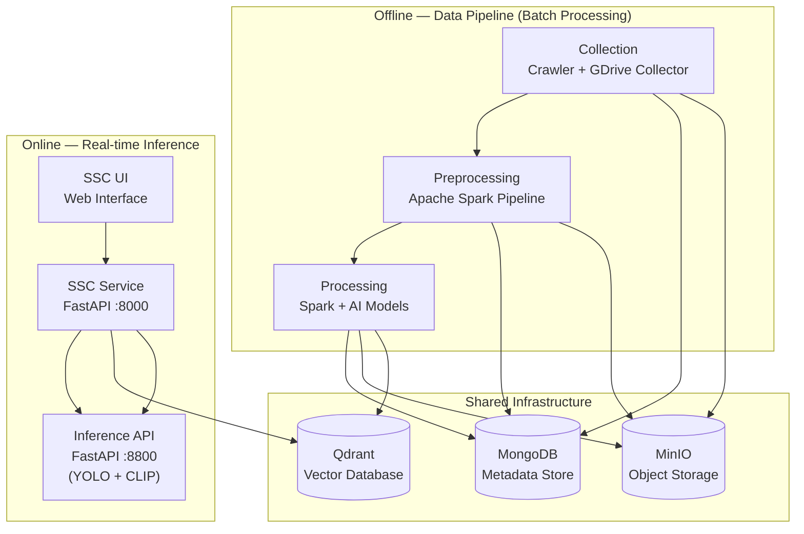

**Mô tả luồng dữ liệu tổng quan:**

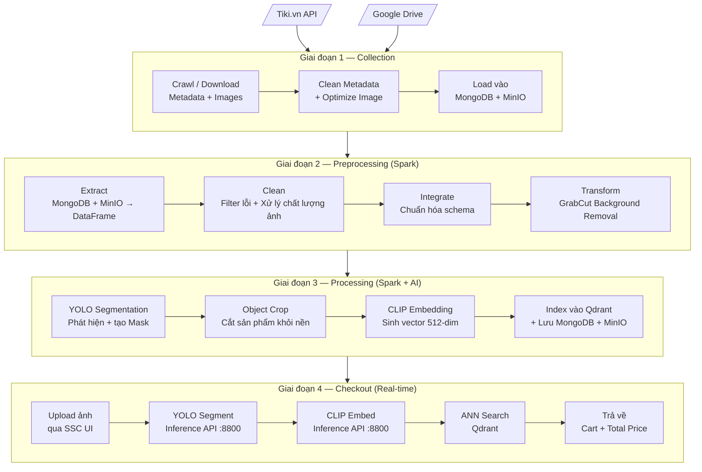

---

### 1.6. Công Nghệ Sử Dụng (Tech Stack)

| Lớp | Công nghệ | Phiên bản | Vai trò |
|---|---|---|---|
| **Thu thập dữ liệu** | Python · `requests` · BeautifulSoup4 · Google Drive API | — | Crawl Tiki API và thu thập từ Google Drive |
| **Xử lý dữ liệu phân tán** | Apache Spark (PySpark) | — | Xử lý dữ liệu song song quy mô lớn |
| **Xử lý ảnh** | OpenCV (headless) · Pillow | `4.9.0.80` · `10.3.0` | Làm sạch, tẩy nền (GrabCut), resize, encode |
| **Object Segmentation** | Ultralytics YOLO (yolov8x-seg / yolo11n-seg) | `8.1.47` | Instance Segmentation — phát hiện và phân vùng vật thể |
| **Feature Extraction** | CLIP (openai/clip-vit-base-patch32) · ResNet50 | `transformers 4.39.3` · `torchvision 0.17.2` | Trích xuất vector đặc trưng 512-dim / 2048-dim |
| **Deep Learning Runtime** | PyTorch | `2.2.2` | Backend tính toán tensor cho CLIP và ResNet |
| **Vector Database** | Qdrant | — | Lưu trữ và tìm kiếm tương đồng vector (ANN Search) |
| **Document Database** | MongoDB | — | Lưu metadata sản phẩm và trạng thái pipeline |
| **Object Storage** | MinIO (S3-compatible) | — | Lưu trữ ảnh nhị phân qua từng giai đoạn |
| **Backend API** | FastAPI · Uvicorn | `0.110.1` · `0.29.0` | Inference API (:8800) và Checkout API (:8000) |
| **Frontend** | HTML · CSS · JavaScript (Vanilla) | — | Giao diện web upload ảnh và hiển thị giỏ hàng |
| **Containerization** | Docker · Docker Compose | — | Đóng gói và điều phối các microservices |

---

## 2. Cơ Sở Lý Thuyết

Phần này trình bày nền tảng lý thuyết của các công nghệ cốt lõi được áp dụng trong hệ thống VSSCS. Nội dung được tổ chức theo trật tự từ tầng dữ liệu đến tầng AI và tầng hạ tầng.

---

### 2.1. Data Pipeline và Mô Hình ETL

#### 2.1.1. Khái niệm ETL

**ETL (Extract – Transform – Load)** là quy trình chuẩn trong kỹ thuật dữ liệu (Data Engineering), mô tả ba bước cốt lõi để đưa dữ liệu từ nguồn thô đến hệ thống đích ở dạng có thể khai thác được.

| Giai đoạn | Mô tả chung | Hiện thực trong VSSCS |
|---|---|---|
| **Extract** | Trích xuất dữ liệu thô từ các nguồn khác nhau | Crawl Tiki API; tải JSON + ảnh từ Google Drive; đọc MongoDB và MinIO qua Spark |
| **Transform** | Làm sạch, chuẩn hóa định dạng, lọc lỗi, biến đổi nội dung | Lọc metadata thiếu trường; xử lý chất lượng ảnh; chuẩn hóa schema; tẩy nền GrabCut |
| **Load** | Nạp dữ liệu đã xử lý vào hệ thống đích | Insert vào MongoDB; upload ảnh lên MinIO; upsert vector vào Qdrant |

#### 2.1.2. Multi-Stage Pipeline — Pipeline Đa Tầng

Trong các hệ thống xử lý dữ liệu lớn, ETL thường được tổ chức thành nhiều tầng nối tiếp (**Multi-Stage Pipeline**), trong đó đầu ra của giai đoạn trước là đầu vào của giai đoạn sau. Mỗi tầng lưu kết quả trung gian ra hệ thống lưu trữ, đảm bảo ba tính chất quan trọng:

- **Fault Tolerance (Khả năng chịu lỗi):** Nếu pipeline gặp lỗi ở tầng nào, có thể chạy lại từ chính tầng đó mà không mất dữ liệu đã xử lý ở tầng trước.
- **Data Lineage (Truy vết nguồn gốc dữ liệu):** Toàn bộ trạng thái dữ liệu sau mỗi bước được lưu lại với đường dẫn MinIO riêng biệt và collection MongoDB độc lập — phục vụ kiểm tra, debug và audit.
- **Separation of Concerns (Tách biệt trách nhiệm):** Mỗi tầng chỉ đảm nhiệm một nhiệm vụ duy nhất — dễ bảo trì, kiểm thử và mở rộng độc lập.

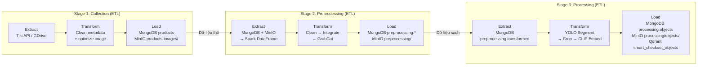

---

### 2.2. Xử Lý Dữ Liệu Phân Tán — Apache Spark

#### 2.2.1. Tổng quan về Apache Spark

**Apache Spark** là framework xử lý dữ liệu phân tán mã nguồn mở, được thiết kế để xử lý tập dữ liệu lớn (Big Data) bằng cách phân chia công việc ra nhiều **executor** (tiến trình xử lý) chạy song song trên một cụm máy chủ (cluster). So với Hadoop MapReduce truyền thống, Spark nhanh hơn nhiều lần nhờ xử lý dữ liệu **trong bộ nhớ RAM** (in-memory computing) thay vì đọc/ghi đĩa liên tục sau mỗi bước.

**PySpark** là API Python của Apache Spark, cho phép lập trình viên sử dụng Python để định nghĩa và chạy các Spark pipeline.

#### 2.2.2. Lazy Evaluation và DAG

Đặc điểm cốt lõi của Spark là **Lazy Evaluation (Tính toán lười)**:

- Khi lập trình viên gọi các **Transformation** (phép biến đổi) như `filter()`, `map()`, `withColumn()`, `join()` — Spark **không thực thi ngay** mà chỉ ghi nhận thao tác vào một **DAG (Directed Acyclic Graph)** — đồ thị có hướng không chu trình biểu diễn toàn bộ kế hoạch thực thi.
- Spark chỉ thực sự chạy tính toán khi gặp một **Action** như `count()`, `collect()`, `write()`, `show()`.
- Nhờ đó, Spark **tối ưu hóa toàn bộ kế hoạch thực thi** trước khi chạy: loại bỏ các bước thừa, đẩy phép lọc xuống sớm nhất có thể (predicate pushdown), gộp các phép biến đổi liên tiếp (pipelining).

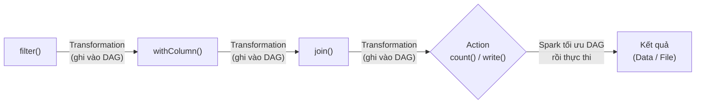

#### 2.2.3. Các Khái Niệm Cơ Bản

| Khái niệm | Mô tả |
|---|---|
| **RDD** (Resilient Distributed Dataset) | Cấu trúc dữ liệu phân tán cơ bản — tập hợp phần tử bất biến, được chia thành nhiều partition, có khả năng phục hồi khi lỗi |
| **DataFrame** | RDD có cấu trúc schema rõ ràng (giống bảng SQL), cung cấp API bậc cao thuận tiện hơn và tích hợp query optimizer (Catalyst) |
| **Partition** | Một phần dữ liệu của RDD/DataFrame — mỗi partition được xử lý độc lập trên một executor core, là đơn vị song song hóa cơ bản |
| **Executor** | Tiến trình JVM chạy trên một node worker, thực hiện các task của Spark |

#### 2.2.4. mapPartitions — Tối ưu cho Tác Vụ Nặng

Thay vì áp một hàm lên từng hàng (`map()`), **`mapPartitions()`** áp hàm lên **toàn bộ một partition** — iterator của nhiều hàng. Điều này cho phép:

- Khởi tạo tài nguyên nặng (model AI, kết nối database, MinIO client) **một lần duy nhất cho cả partition**, không phải mỗi hàng.
- Kết hợp `ThreadPoolExecutor` bên trong `mapPartitions` để xử lý các hàng trong partition song song — đặc biệt hiệu quả khi tác vụ chủ yếu là I/O (gọi HTTP API, tải ảnh từ MinIO).

Trong VSSCS, toàn bộ pipeline AI (YOLO segment → crop → CLIP embed) được triển khai qua `mapPartitions` với `ThreadPoolExecutor(max_workers=2)` trên mỗi partition.

#### 2.2.5. Caching — Cắt Đứt DAG

Khi pipeline xử lý dữ liệu nặng (đặc biệt ảnh binary), nếu không cache, mỗi **Action** tiếp theo sẽ khiến Spark tính toán lại toàn bộ DAG từ đầu — bao gồm cả việc tải lại ảnh từ MinIO và xử lý OpenCV. Giải pháp:

```
df.cache()          # Persist DataFrame vào RAM
df.count()          # Một Action để ép Spark thực thi và giữ kết quả
# → Mọi Action tiếp theo đọc từ cache, không tính lại DAG
```

Gọi `df.unpersist()` khi không còn cần dữ liệu để giải phóng RAM.

---

### 2.3. Xử Lý Ảnh (Image Processing)

#### 2.3.1. Các Vấn Đề Chất Lượng Ảnh Thực Tế

Ảnh sản phẩm thu thập từ internet thường gặp các vấn đề chất lượng ảnh hưởng trực tiếp đến chất lượng embedding:

| Vấn đề | Biểu hiện | Ảnh hưởng đến AI |
|---|---|---|
| **Mờ (Blur)** | Ảnh thiếu nét, cạnh đối tượng bị nhòe | Model khó trích xuất đặc trưng hình dạng và kết cấu (texture) |
| **Nhiễu hạt (Noise)** | Hạt nhiễu trên bề mặt ảnh, hay gặp ở ảnh chụp thiếu sáng | Vector embedding bị nhiễu, giảm độ chính xác similarity search |
| **Chói sáng (Overexposure)** | Vùng sáng quá mức, mất chi tiết texture | Mất thông tin màu sắc và kết cấu bề mặt sản phẩm |
| **Nền phức tạp (Complex Background)** | Hậu cảnh lộn xộn, tay người cầm sản phẩm, đạo cụ | Model học nhầm đặc trưng background, gây sai lệch similarity search |

#### 2.3.2. Sharpening — Làm Sắc Nét Ảnh Mờ

**Phát hiện độ mờ bằng Laplacian Variance:** Tích chập toán tử Laplacian lên ảnh xám, sau đó tính phương sai. Phương sai thấp (ngưỡng < 100) đồng nghĩa với ảnh thiếu nét.

**Tăng độ nét bằng Sharpening Kernel:** Tích chập (convolution) ảnh với kernel 3×3:

```
K = [[-1, -1, -1],
     [-1,  9, -1],
     [-1, -1, -1]]
```

Kernel này khuếch đại vùng cạnh (high-frequency components) bằng cách lấy 9 lần giá trị trung tâm trừ đi tổng các lân cận — hiệu ứng là làm sắc nét các chi tiết và cạnh của vật thể.

#### 2.3.3. Median Blur — Khử Nhiễu Bảo Toàn Cạnh

**Median Blur** thay thế mỗi pixel bằng **giá trị trung vị (median)** của các pixel trong cửa sổ k×k lân cận (k=3 trong VSSCS).

Khác với Gaussian Blur (dùng giá trị trung bình — làm mờ cả cạnh), Median Blur **giữ được cạnh đối tượng sắc nét** trong khi loại bỏ nhiễu hạt hiệu quả. Đây là kỹ thuật được ưa dùng khi cần khử nhiễu salt-and-pepper.

#### 2.3.4. CLAHE — Cân Bằng Độ Tương Phản Thích Nghi

**CLAHE (Contrast Limited Adaptive Histogram Equalization)** là phiên bản cải tiến của Histogram Equalization thông thường:

- **Adaptive:** Chia ảnh thành các **tile** (ô nhỏ, mặc định 8×8 trong VSSCS) và áp histogram equalization cục bộ cho từng tile — xử lý tốt hơn ảnh có độ sáng không đều.
- **Contrast Limited:** Tham số `clipLimit` (=2.0 trong VSSCS) giới hạn biên độ khuếch đại histogram tại mỗi bin — tránh làm nhiễu bị phóng đại quá mức.
- **Không ảnh hưởng màu sắc:** CLAHE chỉ áp dụng trên **kênh L (Lightness)** của không gian màu **CIE LAB** — đảm bảo chỉ thay đổi độ sáng, màu sắc sản phẩm được giữ nguyên.

```
RGB → Chuyển sang LAB → Áp CLAHE lên kênh L → Chuyển về RGB
```

#### 2.3.5. GrabCut — Tẩy Nền Ảnh

**GrabCut** (Rother, Kolmogorov, Blake — Microsoft Research, SIGGRAPH 2004) là thuật toán phân đoạn ảnh (image segmentation) kết hợp hai kỹ thuật:

**a) Gaussian Mixture Model (GMM):**
- Mô hình xác suất phân biệt màu sắc và kết cấu của foreground (vật thể — sản phẩm) và background (nền ảnh).
- Được cập nhật lặp đi lặp lại qua nhiều vòng iteration.

**b) Graph Cut (Min-cut / Max-flow):**
- Biểu diễn ảnh như một đồ thị có trọng số: mỗi pixel là một nút, cạnh nối các pixel lân cận với trọng số phản ánh xác suất thuộc foreground/background từ GMM.
- Bài toán phân đoạn được quy về bài toán **Min-Cut trên đồ thị** — tìm tập cắt nhỏ nhất tách foreground khỏi background.

**Quy trình trong VSSCS:**
1. Hệ thống định nghĩa **ROI (Region of Interest)** = 90% diện tích ảnh trung tâm (5% padding mỗi cạnh), giả định sản phẩm chính nằm trong vùng này.
2. GrabCut xây dựng GMM cho foreground và background dựa trên ROI.
3. Graph Cut phân loại từng pixel: `GC_BGD` (nền chắc chắn), `GC_FGD` (foreground chắc chắn), `GC_PR_BGD`, `GC_PR_FGD` (xác suất).
4. Lặp lại 5 iteration để hội tụ.
5. Từ mask nhị phân (`mask == 2 | mask == 0` → background, còn lại → foreground), vùng background được tô trắng (RGB = 255,255,255).

**Lý do tẩy nền trước khi Embedding:** Nền phức tạp (tay người, phông studio, background bán hàng) sẽ khiến model embedding học và so sánh cả đặc trưng background — gây sai lệch khi hai sản phẩm khác nhau có background giống nhau. Nền trắng đồng nhất buộc model tập trung hoàn toàn vào hình thái và màu sắc của sản phẩm.

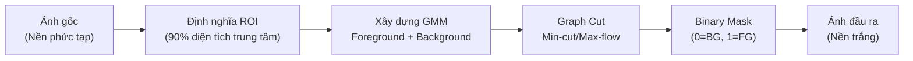

---

### 2.4. Instance Segmentation — Phân Vùng Đối Tượng

#### 2.4.1. Phân Loại Các Bài Toán Nhận Diện Đối Tượng

Có bốn bậc bài toán chính trong Computer Vision liên quan đến nhận diện đối tượng, với mức độ chi tiết tăng dần:

| Bài toán | Đầu ra | Phân biệt các thực thể | Mức độ chi tiết |
|---|---|---|---|
| **Image Classification** | Nhãn lớp của cả ảnh | Không | Thấp nhất |
| **Object Detection** | Bounding Box + nhãn lớp cho từng vật thể | Có | Trung bình |
| **Semantic Segmentation** | Mask pixel theo lớp (không phân biệt thực thể riêng lẻ) | Không | Cao |
| **Instance Segmentation** | Mask pixel riêng biệt cho **từng thực thể** | Có | Cao nhất |

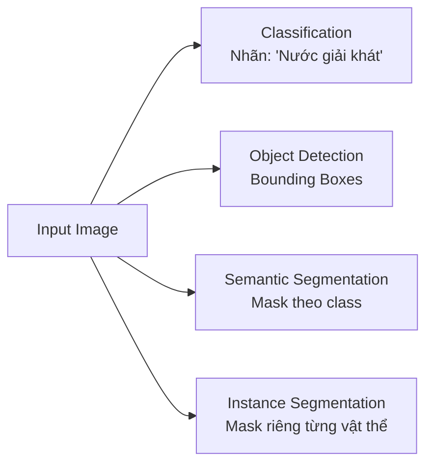

Trong VSSCS, **Instance Segmentation** là bắt buộc vì khi một ảnh chứa nhiều sản phẩm, cần biết chính xác **pixel nào thuộc sản phẩm nào** — không chỉ vị trí tương đối.

#### 2.4.2. YOLO — You Only Look Once

**YOLO (You Only Look Once)** là họ mô hình object detection nổi tiếng với khả năng xử lý **thời gian thực**. Kiến trúc YOLO xử lý toàn bộ ảnh chỉ trong **một lần forward pass** duy nhất qua mạng neural — khác với các mô hình 2-stage truyền thống (Faster R-CNN) phải trải qua hai bước riêng biệt (Region Proposal → Classification).

**Kiến trúc YOLO hiện đại (YOLOv8/YOLO11):**

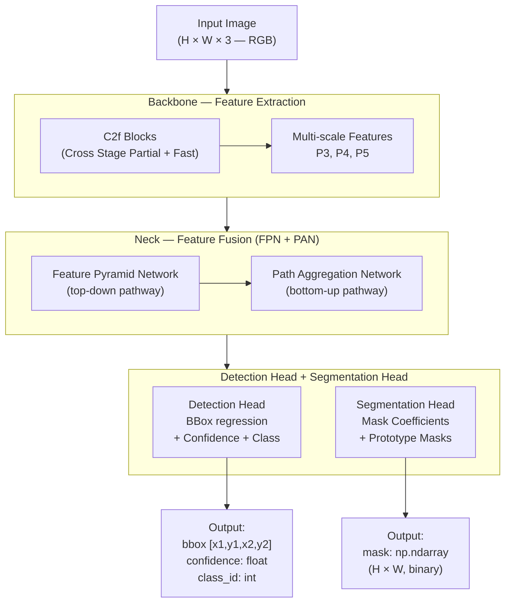

**Giải thích các thành phần:**
- **Backbone (C2f):** Trích xuất đặc trưng (feature maps) ở nhiều tỉ lệ khác nhau từ ảnh đầu vào. C2f (Cross Stage Partial with 2 convolutions fast) là cải tiến của CSPNet giúp cân bằng tốc độ và độ chính xác.
- **Neck (FPN + PAN):** Feature Pyramid Network kết hợp đặc trưng từ nhiều tầng (top-down) để phát hiện tốt cả vật thể lớn lẫn nhỏ. Path Aggregation Network bổ sung luồng bottom-up tăng cường định vị.
- **Detection Head:** Dự đoán bounding box (tọa độ x1,y1,x2,y2), độ tin cậy (confidence score) và nhãn lớp (class_id) cho từng vật thể.
- **Segmentation Head:** Dự đoán mask coefficients kết hợp với prototype masks để tạo ra polygon mask nhị phân cho từng vật thể.

**Mô hình sử dụng trong VSSCS:**
- `yolov8x-seg.pt` (Inference API server — chế độ Local, độ chính xác cao nhất)
- `yolo11n-seg.pt` (tích hợp trong pipeline Spark — chế độ Local, nhỏ gọn)

**Non-Maximum Suppression (NMS):** Sau khi YOLO tạo ra nhiều dự đoán chồng nhau, NMS loại bỏ các dự đoán trùng lặp: sắp xếp theo confidence giảm dần, giữ lại dự đoán có confidence cao nhất, loại các dự đoán có IoU (Intersection over Union) vượt ngưỡng với dự đoán đã giữ.

**Cơ chế crop và áp mask trong VSSCS:**

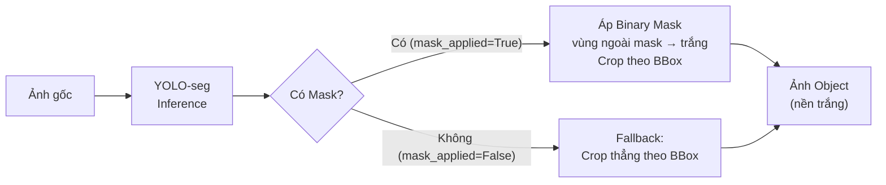

Hệ thống chỉ giữ lại **object có confidence score cao nhất** vì mỗi ảnh sản phẩm chỉ chứa một sản phẩm chính.

---

### 2.5. Feature Embedding — Trích Xuất Đặc Trưng Hình Ảnh

#### 2.5.1. Khái Niệm Embedding

**Embedding** (hay Feature Vector) là quá trình **mã hóa dữ liệu phi cấu trúc** (ảnh, văn bản, âm thanh) thành một **vector số thực nhiều chiều** trong một không gian toán học liên tục, sao cho:

- Các đối tượng **ngữ nghĩa giống nhau** → vector **gần nhau** trong không gian (khoảng cách nhỏ, góc nhỏ).
- Các đối tượng **ngữ nghĩa khác nhau** → vector **xa nhau** trong không gian.

Nhờ đặc tính này, bài toán "tìm sản phẩm có ảnh giống nhất" trở thành bài toán **tìm vector gần nhất (Nearest Neighbor Search)** — giải hiệu quả bằng các cấu trúc dữ liệu chuyên biệt.

#### 2.5.2. CLIP — Contrastive Language-Image Pretraining

**CLIP** (Radford et al., OpenAI, ICML 2021) là mô hình nền tảng (foundation model) được huấn luyện trên **400 triệu cặp (ảnh, văn bản)** thu thập từ internet theo phương pháp **Contrastive Learning**:

- Mỗi cặp (ảnh, văn bản mô tả) được huấn luyện để có embedding gần nhau trong không gian vector chung.
- Các cặp sai (ảnh của item này, văn bản của item khác) được huấn luyện để có embedding xa nhau.
- Hàm mất mát: **InfoNCE Loss** (symmetric cross-entropy trên ma trận similarity).

**Kiến trúc CLIP:**

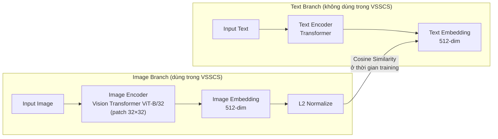

Trong VSSCS, **chỉ sử dụng Image Encoder** của CLIP để biến đổi ảnh sản phẩm → vector 512 chiều. Vector được **L2 Normalize** (chia cho norm L2) trước khi lưu vào Qdrant để tương thích với Cosine Similarity.

**Vision Transformer (ViT-B/32):**
- Ảnh được chia thành các **patch 32×32 pixel** — mỗi patch là một "token" (như từ trong NLP).
- Các patch được flatten, ghép Position Embedding và đưa qua **Multi-Head Self-Attention** layers của Transformer.
- Token `[CLS]` (class token) ở đầu chuỗi tổng hợp thông tin toàn cục → dùng làm image embedding.

**Ưu điểm của CLIP cho bài toán nhận diện sản phẩm:**
- Học được đặc trưng **ngữ nghĩa cao**: phân biệt sản phẩm theo hình dạng, màu sắc, kết cấu và ngữ cảnh thương mại.
- **Zero-shot generalization**: Hoạt động tốt trên ảnh sản phẩm mới mà không cần fine-tuning thêm.
- Pre-trained trên dữ liệu cực kỳ đa dạng → tổng quát hóa tốt.

#### 2.5.3. ResNet50 — Phương Án Dự Phòng (Fallback)

**ResNet (Residual Network)** (He, Zhang, Ren, Sun — Microsoft Research, arXiv 2015, CVPR 2016) giải quyết vấn đề **Vanishing Gradient** trong mạng neural sâu bằng cơ chế **Skip Connection (kết nối tắt)**:

```
Thông thường:     Output = F(x)
ResNet:           Output = F(x) + x
```

Thay vì học hàm `H(x)` trực tiếp, mạng chỉ cần học **phần dư** `F(x) = H(x) − x`. Gradient có thể lan truyền trực tiếp qua skip connection mà không bị triệt tiêu — cho phép huấn luyện mạng rất sâu (50, 101, 152 lớp).

**ResNet50 trong VSSCS:**
- Được tải từ `torchvision.models.resnet50(pretrained=True)`.
- Lớp **Fully Connected cuối** được bỏ đi (`Sequential(*list(model.children())[:-1])`).
- Đầu ra: feature vector **2048 chiều** (average pooled output của lớp conv cuối).
- Ảnh được resize về 224×224, normalize theo ImageNet statistics (mean=[0.485, 0.456, 0.406], std=[0.229, 0.224, 0.225]).
- Được dùng khi thư viện `transformers` (cần cho CLIP) không có sẵn.

---

### 2.6. Vector Database và Tìm Kiếm Tương Đồng

#### 2.6.1. Vector Database là gì?

**Vector Database** là hệ thống cơ sở dữ liệu được tối ưu hóa chuyên biệt để **lưu trữ và tra cứu** các vector nhiều chiều (high-dimensional vectors). Điểm khác biệt cốt lõi so với cơ sở dữ liệu quan hệ truyền thống:

| Tiêu chí | CSDL Quan hệ (SQL) | Vector Database |
|---|---|---|
| Đơn vị lưu trữ | Hàng (row) theo schema cố định | Vector (float array) + Payload (metadata) |
| Kiểu truy vấn | Tìm kiếm chính xác (exact match) theo điều kiện | Tìm kiếm tương đồng (similarity search) theo khoảng cách vector |
| Phù hợp với | Dữ liệu có cấu trúc, truy vấn filter | Dữ liệu phi cấu trúc (ảnh, văn bản) đã được embedding |
| Thuật toán index | B-tree, Hash | HNSW, IVF, PQ và các thuật toán ANN |

#### 2.6.2. Cosine Similarity

Trong không gian vector, **Cosine Similarity** đo mức độ tương đồng dựa trên **góc** giữa hai vector, không phụ thuộc vào độ lớn (magnitude):

$$\text{cosine\_similarity}(\mathbf{A}, \mathbf{B}) = \frac{\mathbf{A} \cdot \mathbf{B}}{|\mathbf{A}| \cdot |\mathbf{B}|} = \frac{\sum_{i=1}^{n} A_i B_i}{\sqrt{\sum_{i=1}^{n} A_i^2} \cdot \sqrt{\sum_{i=1}^{n} B_i^2}}$$

- **Kết quả:** [-1, +1], trong đó +1 = hai vector hoàn toàn cùng chiều (tương đồng tối đa), 0 = vuông góc (không liên quan), -1 = trái chiều.
- **Sau L2 Normalize** (|**A**| = |**B**| = 1): Cosine Similarity tương đương **Dot Product** → tính toán nhanh hơn.

**Ngưỡng trong VSSCS:** `score ≥ 0.6` → sản phẩm được xem là khớp (match); `score < 0.6` → bỏ qua.

**Lý do ưu tiên Cosine thay vì Euclidean Distance:** Cosine không bị ảnh hưởng bởi độ lớn tuyệt đối của vector — phù hợp với embedding ngữ nghĩa, nơi **hướng** của vector quan trọng hơn độ dài.

#### 2.6.3. Approximate Nearest Neighbor (ANN) Search

Tìm kiếm **Exact Nearest Neighbor** (duyệt toàn bộ tập) có độ phức tạp O(N·d) — không khả thi khi N lên đến hàng triệu vector. **ANN Search** chấp nhận sai số nhỏ để đổi lấy tốc độ cực cao.

**HNSW (Hierarchical Navigable Small World Graph)** (Malkov & Yashunin, 2018) — thuật toán ANN được Qdrant sử dụng:

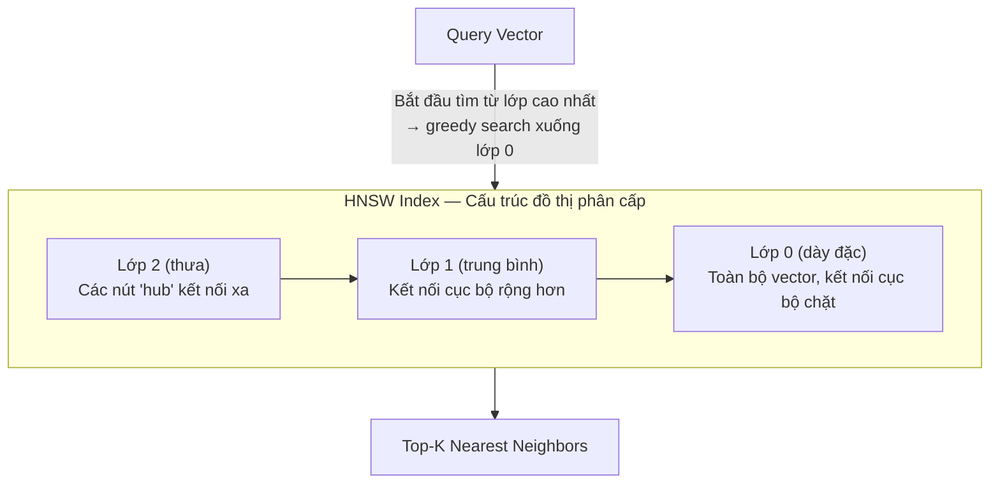

- **Xây dựng index:** Khi insert vector mới, HNSW kết nối nó với M láng giềng gần nhất tại mỗi lớp.
- **Tìm kiếm:** Bắt đầu từ lớp cao nhất (ít nút nhất), greedy walk đến láng giềng gần nhất, sau đó xuống lớp thấp hơn — độ phức tạp trung bình **O(log N)** thay vì O(N).

#### 2.6.4. Qdrant — Hệ Thống Vector Database Được Sử Dụng

**Qdrant** là một Vector Database mã nguồn mở hiệu suất cao, viết bằng Rust. Các khái niệm cốt lõi:

| Khái niệm | Mô tả | Trong VSSCS |
|---|---|---|
| **Collection** | Nhóm các Point có cùng kích thước vector và metric khoảng cách | `smart_checkout_objects` (512-dim, COSINE) |
| **Point** | Đơn vị cơ bản: `{id, vector, payload}` | Mỗi object sản phẩm đã crop = 1 point |
| **Vector** | Mảng float đặc trưng của đối tượng | CLIP embedding 512-dim, L2-normalized |
| **Payload** | Metadata đi kèm point, trả về khi search | `{sku, name, price, platform, minio_image_path, ...}` |
| **Upsert** | Insert hoặc Update — idempotent operation | Batch upsert 64 points/lần để giảm network calls |

**Quy trình Indexing (offline) và Searching (online):**

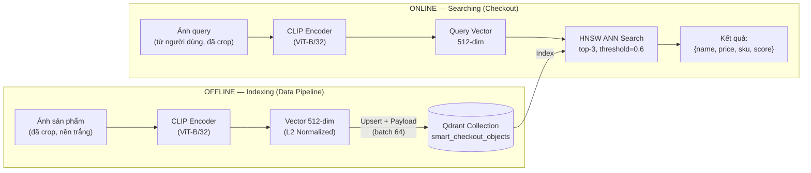

---

### 2.7. Hạ Tầng Lưu Trữ và Triển Khai

#### 2.7.1. MongoDB — Document Database

**MongoDB** là hệ quản trị cơ sở dữ liệu NoSQL hướng tài liệu (Document-Oriented DBMS). Mỗi bản ghi được lưu dưới dạng **BSON document** (Binary JSON) với cấu trúc linh hoạt.

**Lý do chọn MongoDB cho VSSCS:**
- Dữ liệu sản phẩm từ Tiki rất **đa dạng về schema** — sản phẩm điện thoại, thực phẩm, quần áo có tập trường thông tin hoàn toàn khác nhau. MongoDB xử lý tốt điều này mà không cần định nghĩa schema cứng nhắc trước.
- Hỗ trợ **MongoDB Spark Connector** (`org.mongodb.spark:mongo-spark-connector_2.13:10.4.0`) — tích hợp trực tiếp vào Spark pipeline để đọc/ghi DataFrame phân tán.
- Thuận tiện làm **metadata store đa tầng** — mỗi giai đoạn pipeline ghi vào collection độc lập.

**Cấu trúc MongoDB trong VSSCS:**

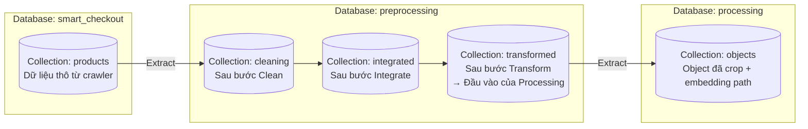

#### 2.7.2. MinIO — Object Storage

**MinIO** là hệ thống lưu trữ đối tượng (Object Storage) mã nguồn mở, **tương thích hoàn toàn với Amazon S3 API**. Dữ liệu được tổ chức theo mô hình phẳng: `Bucket → Object (Key → Binary Value)`.

**Lý do tách lưu trữ ảnh ra khỏi MongoDB:**
- Lưu blob nhị phân lớn trực tiếp trong MongoDB làm tăng kích thước document, chậm query metadata (vốn không cần ảnh).
- MinIO được tối ưu cho streaming file lớn: hỗ trợ multipart upload, chunked download, presigned URL.
- Kiến trúc tách biệt metadata và binary là best practice trong hệ thống xử lý đa phương tiện.

**Cấu trúc MinIO trong VSSCS:**

| Bucket | Path Pattern | Giai đoạn |
|---|---|---|
| `products-images` | `{filename}.jpg` | Collection — ảnh thô từ Tiki/GDrive |
| `smart-checkout` | `preprocessing/clean/{id}.jpg` | Preprocessing — sau Clean |
| `smart-checkout` | `preprocessing/integrate/{id}.jpg` | Preprocessing — sau Integrate |
| `smart-checkout` | `preprocessing/transform/{id}.jpg` | Preprocessing — sau Transform |
| `smart-checkout` | `processing/objects/{sku}/{sub_id}.jpg` | Processing — ảnh crop sản phẩm cuối cùng |

#### 2.7.3. Kiến Trúc Microservices và Docker

**Microservices** là kiến trúc phần mềm trong đó ứng dụng được tách thành các **service nhỏ, độc lập** — mỗi service đảm nhiệm một chức năng cụ thể, giao tiếp với nhau qua REST API hoặc Message Queue. Ưu điểm: deploy độc lập, scale riêng từng service, lỗi một service không làm sập toàn hệ thống.

**Docker** đóng gói mỗi service vào một **container** độc lập chứa đầy đủ code, runtime, thư viện và cấu hình — đảm bảo chạy nhất quán trên mọi môi trường.

**Docker Compose** trong VSSCS điều phối toàn bộ các container qua file YAML:

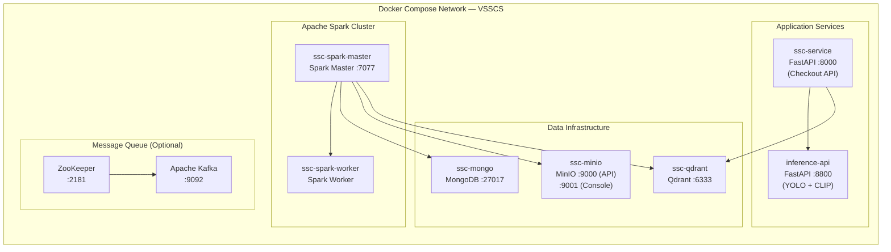

**Vai trò của Apache Kafka (dự phòng):** Trong thiết kế mở rộng, Kafka hoạt động như Message Queue giữa các Spark job và inference workers — cho phép mở rộng horizontal (thêm nhiều GPU worker) mà không thay đổi kiến trúc tổng thể. Cấu hình Kafka đã được chuẩn bị sẵn trong `docker/docker_compose/kafka-docker-compose.yml`.

---

*Tài liệu được biên soạn và xác minh (verified) trực tiếp từ source code của repository `smart-checkout` — VSSCS project.*
*Mọi thông số kỹ thuật (port, threshold, batch size, model name, collection name, embedding dimension) đều được lấy từ code thực tế.*
