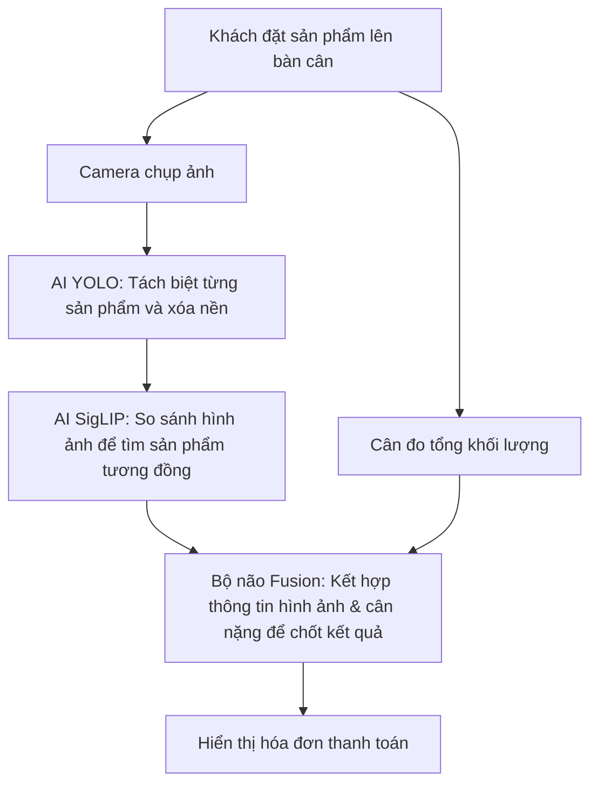

# 🛒 Hướng dẫn Dự án: Hệ thống Thanh toán Thông minh (Smart Checkout)

Tài liệu này được viết riêng cho người dùng phi kỹ thuật (non-tech), giúp bạn hiểu hệ thống **Smart Checkout** hoạt động như thế nào, nó giải quyết vấn đề gì và tại sao nó lại thông minh đến vậy.

---

## 🌟 Smart Checkout là gì?

Hãy tưởng tượng bạn đi siêu thị, thay vì phải cầm từng món đồ lên, xoay đi xoay lại để tìm mã vạch (barcode) và quét qua máy quét rất mất thời gian, bạn chỉ cần **đặt tất cả món đồ lên bàn cân**. Ngay lập tức (chưa đầy 1 giây), màn hình sẽ hiển thị đầy đủ danh sách món đồ cùng tổng số tiền cần thanh toán.

Đó chính là **Smart Checkout** – một hệ thống thanh toán tự động kết hợp giữa **Trí tuệ nhân tạo (AI)** và **Cân điện tử thông minh**.

---

## 🛠️ Hệ thống hoạt động như thế nào?

Hệ thống hoạt động dựa trên sự kết hợp nhịp nhàng giữa **Mắt (Camera)** và **Tay (Cân nặng)**:

### Bước 1: Nhìn nhận (Camera & AI YOLO)
Ngay khi bạn đặt sản phẩm lên, camera từ phía trên (và hai bên hông nếu có nhiều camera) sẽ chụp ảnh. Trí tuệ nhân tạo (YOLO) sẽ đóng vai trò như đôi mắt, tự động phát hiện ra có bao nhiêu vật thể trên bàn cân và **cắt riêng từng sản phẩm ra khỏi ảnh nền** (ví dụ: tách gói mì, lon nước ra khỏi mặt bàn cân).

### Bước 2: Nhớ mặt (AI SigLIP & Cơ sở dữ liệu)
Sau khi có ảnh riêng của từng sản phẩm đã được xóa nền, hệ thống sẽ sử dụng một mô hình AI khác (SigLIP) để chuyển đổi hình ảnh đó thành một chuỗi mã số đặc trưng. Chuỗi mã số này sẽ được so sánh với toàn bộ thư viện sản phẩm đã đăng ký trong cơ sở dữ liệu để tìm ra các sản phẩm giống nhất (ví dụ: giống mì Hảo Hảo 85%, giống mì Omachi 40%).

### Bước 3: Cân đo & Quyết định (Thuật toán Kết hợp Cân nặng - Fusion)
Đây là phần **thông minh nhất** của hệ thống. Đôi khi camera có thể nhìn nhầm hoặc bị mờ, nhưng cân nặng thì không biết nói dối. Hệ thống sẽ lấy tổng cân nặng thực tế từ cân điện tử dưới bàn cân và so sánh với cân nặng tiêu chuẩn của các sản phẩm đang nghi ngờ:
- **Trường hợp phân vân**: Camera thấy một gói màu vàng đỏ, không rõ là Mì Hảo Hảo (nặng 75g) hay Bánh Lays (nặng 100g). Nếu cân báo nặng 75g, hệ thống lập tức chốt đó là Mì Hảo Hảo.
- **Trường hợp xếp chồng (bị che khuất)**: Bạn đặt 2 gói mì xếp chồng lên nhau, camera chỉ nhìn thấy 1 gói từ trên xuống. Nhưng cân báo nặng 150g (bằng 2 gói mì). Hệ thống sẽ tự động biết rằng có 2 gói mì đang nằm chồng lên nhau và tính tiền đủ 2 gói!

---

## 💎 Những lợi ích vượt trội

> [!TIP]
> **Thanh toán siêu tốc**: Giảm thời gian chờ đợi tại quầy thu ngân xuống dưới 5 giây cho mỗi lượt thanh toán.
> **Không cần quét mã vạch**: Người dùng hoặc nhân viên không cần phải xoay sản phẩm tìm barcode, chỉ cần đặt sản phẩm lên bàn cân là xong.
> **Chống gian lận**: Ngăn chặn hành vi tráo đổi tem nhãn hoặc giấu sản phẩm, vì cân nặng thực tế của giỏ hàng bắt buộc phải khớp với hình ảnh camera chụp được.
> **Thanh toán nhiều món cùng lúc**: Nhận diện tốt khi đặt nhiều sản phẩm đa dạng lên khay cùng một lúc.

---

## 📂 Giải thích các thuật ngữ kỹ thuật (nếu bạn tò mò)

Nếu bạn nghe các lập trình viên nói chuyện về dự án này, dưới đây là cách dịch từ ngôn ngữ kỹ thuật sang ngôn ngữ đời thường:

- **YOLO (Segmentation)**: Công cụ AI chuyên dùng để "vẽ đường biên" và cắt sản phẩm ra khỏi ảnh.
- **SigLIP**: Công cụ AI chuyên chuyển đổi hình ảnh thành "vân tay số" để máy tính dễ so sánh độ giống nhau.
- **Milvus**: Một loại tủ hồ sơ siêu tốc, chuyên dùng để lưu trữ và tìm kiếm các "vân tay số" của sản phẩm trong mili-giây.
- **Knapsack Solver (Thuật toán balo)**: Thuật toán toán học giúp lựa chọn kết hợp các sản phẩm sao cho vừa khít với tổng cân nặng thực tế trên cân.
