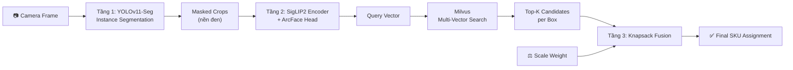

# Smart Checkout — AI Production System
## Nâng cấp 3 tầng: YOLO-Seg + Multi-Vector Embedding + Knapsack Fusion

---

## Tổng quan

Xây dựng hệ thống AI nhận diện sản phẩm tại quầy checkout tự động, kết hợp **camera + bàn cân** để xác định chính xác sản phẩm và giá tiền. Hệ thống được thiết kế theo kiến trúc **Pipeline 3 tầng**:



> [!IMPORTANT]
> Dự án này là **greenfield** (thư mục `/home/nam/Project/smart checkout` đang trống). Toàn bộ code sẽ được viết mới từ đầu, tối ưu cho production.

---

## User Review Required

> [!WARNING]
> **Quyết định phần cứng/infra cần xác nhận trước khi code:**
> 1. **Milvus**: Bạn đã có Milvus server chạy sẵn chưa? Nếu chưa, tôi sẽ thêm `docker-compose.yml` để khởi tạo Milvus Standalone.
> 2. **GPU**: Máy inference chạy GPU gì? (GTX 1660 / RTX 3060 / RTX 4090 / Jetson?) — ảnh hưởng đến việc chọn model size YOLO & SigLIP2.
> 3. **Bàn cân**: Giao tiếp qua giao thức gì? (Serial COM / USB HID / HTTP API / Mock data cho dev?)
> 4. **Dataset sản phẩm**: Bạn đã có ảnh catalog các SKU chưa? Bao nhiêu SKU dự kiến?

---

## Open Questions

> [!IMPORTANT]
> 1. **SigLIP2 model size**: Recommend dùng `google/siglip2-base-patch16-224` (86M params, nhanh) hay `google/siglip2-so400m-patch14-384` (400M params, chính xác hơn)? Phụ thuộc vào GPU budget.
> 2. **YOLO-seg pretrained**: Dùng `yolo11n-seg.pt` (nano, siêu nhanh) hay `yolo11m-seg.pt` (medium, chính xác hơn)? Có cần custom train YOLO trên dataset sản phẩm riêng không?
> 3. **ArcFace fine-tuning**: Bạn đã có labeled dataset (ảnh + label SKU) chưa? Cần bao nhiêu ảnh/SKU tối thiểu? Recommend: 20-50 ảnh/SKU ở các góc khác nhau.
> 4. **Số lượng vector/SKU**: Recommend 5-10 vectors. Bạn muốn bao nhiêu? (Ảnh hưởng Milvus storage)
> 5. **Tolerance cân**: Sai số trọng lượng chấp nhận được là bao nhiêu gram? (VD: ±5g, ±10g?)

---

## Proposed Changes

### Cấu trúc dự án tổng thể

```
smart checkout/
├── config/
│   └── settings.yaml              # Toàn bộ cấu hình hệ thống
├── src/
│   ├── __init__.py
│   ├── core/
│   │   ├── __init__.py
│   │   ├── config.py              # Config loader (Pydantic)
│   │   └── logger.py              # Structured logging
│   ├── detection/
│   │   ├── __init__.py
│   │   ├── yolo_segmentor.py      # [MŨI KHOAN 1] YOLO-seg wrapper
│   │   └── mask_processor.py      # Background removal, crop extraction
│   ├── embedding/
│   │   ├── __init__.py
│   │   ├── siglip_encoder.py      # SigLIP2 feature extractor
│   │   ├── arcface_head.py        # [MŨI KHOAN 2] ArcFace loss + projection head
│   │   └── fine_tune.py           # Training script cho metric learning
│   ├── database/
│   │   ├── __init__.py
│   │   ├── milvus_client.py       # [MŨI KHOAN 2] Multi-vector Milvus ops
│   │   ├── sku_catalog.py         # SKU metadata (tên, giá, trọng lượng)
│   │   └── ingest_pipeline.py     # Pipeline nạp ảnh catalog → vectors → Milvus
│   ├── fusion/
│   │   ├── __init__.py
│   │   ├── knapsack_solver.py     # [MŨI KHOAN 3] Weight-constrained optimization
│   │   └── candidate_ranker.py    # Score aggregation + final decision
│   ├── scale/
│   │   ├── __init__.py
│   │   ├── base.py                # Abstract scale interface
│   │   ├── serial_scale.py        # Real hardware (serial COM)
│   │   └── mock_scale.py          # Mock cho development
│   ├── pipeline/
│   │   ├── __init__.py
│   │   └── checkout_pipeline.py   # End-to-end orchestrator
│   └── api/
│       ├── __init__.py
│       └── server.py              # FastAPI REST server
├── scripts/
│   ├── ingest_catalog.py          # CLI: Nạp ảnh catalog vào Milvus
│   ├── train_arcface.py           # CLI: Fine-tune SigLIP2 + ArcFace
│   ├── evaluate.py                # CLI: Đánh giá accuracy trên test set
│   └── demo_webcam.py             # CLI: Demo realtime qua webcam
├── data/
│   ├── catalog/                   # Ảnh catalog theo SKU (data/catalog/SKU001/*.jpg)
│   ├── training/                  # Ảnh training cho ArcFace
│   └── sku_metadata.json          # Metadata: tên, giá, trọng lượng từng SKU
├── models/                        # Thư mục chứa model weights
│   ├── yolo11m-seg.pt
│   └── siglip2_arcface_finetuned/
├── tests/
│   ├── test_detection.py
│   ├── test_embedding.py
│   ├── test_fusion.py
│   ├── test_milvus.py
│   └── test_pipeline.py
├── docker-compose.yml             # Milvus + MinIO + etcd
├── Dockerfile                     # App container
├── requirements.txt
├── Makefile                       # Shortcuts: make ingest, make train, make serve
└── README.md
```

---

### Component 1: Configuration System

#### [NEW] [settings.yaml](file:///home/nam/Project/smart%20checkout/config/settings.yaml)
Centralized config cho toàn bộ hệ thống:
```yaml
detection:
  model_path: "models/yolo11m-seg.pt"
  confidence_threshold: 0.5
  iou_threshold: 0.45
  device: "cuda:0"
  img_size: 640

embedding:
  model_name: "google/siglip2-base-patch16-224"
  embedding_dim: 768
  device: "cuda:0"
  batch_size: 16
  
  # ArcFace fine-tuning config
  arcface:
    margin: 0.5
    scale: 64
    num_epochs: 50
    learning_rate: 0.001
    weight_decay: 0.0005

milvus:
  host: "localhost"
  port: 19530
  collection_name: "smart_checkout_products"
  metric_type: "COSINE"
  index_type: "IVF_FLAT"
  nlist: 128
  top_k: 5
  vectors_per_sku: 10  # Multi-vector: max vectors per SKU

fusion:
  weight_tolerance_grams: 10  # ±10g sai số cho phép
  vision_weight: 0.7          # Trọng số vision score trong objective
  weight_penalty: 0.3         # Trọng số weight penalty
  max_items_on_table: 20      # Giới hạn max sản phẩm trên bàn

scale:
  type: "mock"  # "serial" | "mock"
  serial_port: "/dev/ttyUSB0"
  baud_rate: 9600

server:
  host: "0.0.0.0"
  port: 8000
```

#### [NEW] [config.py](file:///home/nam/Project/smart%20checkout/src/core/config.py)
Pydantic-based config loader với validation mạnh, auto-load từ YAML.

#### [NEW] [logger.py](file:///home/nam/Project/smart%20checkout/src/core/logger.py)
Structured logging với `structlog`, format JSON cho production, colorized cho dev.

---

### Component 2: Tầng 1 — YOLO-Seg Instance Segmentation (Mũi Khoan 1)

#### [NEW] [yolo_segmentor.py](file:///home/nam/Project/smart%20checkout/src/detection/yolo_segmentor.py)

**Mục đích**: Thay thế YOLO Detection bằng YOLO Instance Segmentation.

**API chính**:
```python
class YOLOSegmentor:
    def __init__(self, config: DetectionConfig)
    
    def detect(self, frame: np.ndarray) -> list[DetectionResult]:
        """
        Trả về list DetectionResult, mỗi item chứa:
        - bbox: [x1, y1, x2, y2]
        - mask: np.ndarray (H, W) binary mask
        - confidence: float
        - class_id: int
        """

@dataclass
class DetectionResult:
    bbox: list[float]
    mask: np.ndarray        # Binary mask pixel-level
    confidence: float
    class_id: int
    class_name: str
```

**Chi tiết kỹ thuật**:
- Load `YOLO("yolo11m-seg.pt")` từ Ultralytics
- Gọi `model.predict(frame, conf=threshold)` 
- Trích xuất `result.masks.data` → binary mask per object
- Trả về mask cùng bbox, confidence cho downstream

---

#### [NEW] [mask_processor.py](file:///home/nam/Project/smart%20checkout/src/detection/mask_processor.py)

**Mục đích**: Dùng mask từ YOLO-seg để cắt sản phẩm **sạch 100%** (không có nền).

**API chính**:
```python
class MaskProcessor:
    def extract_clean_crop(
        self, 
        frame: np.ndarray, 
        detection: DetectionResult,
        background_color: tuple = (0, 0, 0)  # Nền đen
    ) -> np.ndarray:
        """
        1. Lấy bounding box region từ frame
        2. Áp dụng binary mask → set tất cả pixel nền = background_color
        3. Resize về kích thước chuẩn cho SigLIP2 (224x224)
        4. Return ảnh sản phẩm sạch, nền đen
        """
    
    def extract_batch(
        self, 
        frame: np.ndarray, 
        detections: list[DetectionResult]
    ) -> list[np.ndarray]:
        """Batch processing cho nhiều detections"""
```

**Tại sao nền đen?**: SigLIP2 pretrained trên ảnh sản phẩm e-commerce thường có nền trắng/đen. Nền đen giúp model focus 100% vào texture và shape của sản phẩm, loại bỏ noise từ mặt bàn checkout, bóng đổ, ánh sáng neon.

---

### Component 3: Tầng 2 — SigLIP2 + ArcFace Embedding (Mũi Khoan 2)

#### [NEW] [siglip_encoder.py](file:///home/nam/Project/smart%20checkout/src/embedding/siglip_encoder.py)

**Mục đích**: Trích xuất embedding vector từ ảnh sản phẩm đã cleaned.

**API chính**:
```python
class SigLIPEncoder:
    def __init__(self, config: EmbeddingConfig)
    
    def encode(self, image: np.ndarray) -> np.ndarray:
        """Single image → 768-dim vector (normalized L2)"""
    
    def encode_batch(self, images: list[np.ndarray]) -> np.ndarray:
        """Batch images → (N, 768) matrix"""
```

**Chi tiết kỹ thuật**:
- Load `AutoModel.from_pretrained("google/siglip2-base-patch16-224")`
- Load `AutoProcessor.from_pretrained(...)` cho image preprocessing
- Gọi `model.get_image_features(**inputs)` → raw embedding
- L2 normalize → final vector
- Support mixed precision (fp16) cho tốc độ trên GPU

---

#### [NEW] [arcface_head.py](file:///home/nam/Project/smart%20checkout/src/embedding/arcface_head.py)

**Mục đích**: ArcFace projection head để fine-tune SigLIP2 cho domain sản phẩm cụ thể.

**API chính**:
```python
class ArcFaceHead(nn.Module):
    """
    Additive Angular Margin Loss head.
    Ép embeddings cùng SKU → cụm chặt, khác SKU → xa tối đa.
    """
    def __init__(self, embedding_dim: int, num_classes: int, margin: float, scale: float)
    
    def forward(self, embeddings: Tensor, labels: Tensor) -> Tensor:
        """
        1. Normalize embeddings & weight matrix
        2. Compute cosine similarity
        3. Add angular margin penalty to target class
        4. Scale & return logits for CrossEntropyLoss
        """

class ProductEmbeddingModel(nn.Module):
    """
    SigLIP2 backbone (frozen/unfrozen) + ArcFace head.
    """
    def __init__(self, config: EmbeddingConfig)
    def get_embedding(self, image: Tensor) -> Tensor  # Inference mode
    def forward(self, image: Tensor, label: Tensor) -> Tensor  # Training mode
```

**Chi tiết kỹ thuật**:
- **Phase 1** (20 epochs): Freeze SigLIP2 backbone, chỉ train ArcFace head
- **Phase 2** (30 epochs): Unfreeze last 4 layers của SigLIP2, fine-tune cùng ArcFace
- Loss: `CrossEntropyLoss(ArcFace_logits)`
- Optimizer: `AdamW` với learning rate warmup + cosine decay

---

#### [NEW] [fine_tune.py](file:///home/nam/Project/smart%20checkout/src/embedding/fine_tune.py)

**Mục đích**: Training script hoàn chỉnh cho ArcFace metric learning.

**Chức năng**:
- Load dataset từ `data/training/` (cấu trúc: `data/training/{SKU_ID}/*.jpg`)
- Data augmentation: random rotation (±15°), color jitter, horizontal flip, random erasing
- Train loop với mixed precision (AMP)
- Validation: Recall@1, Recall@5 trên held-out set
- Save best model checkpoint → `models/siglip2_arcface_finetuned/`
- TensorBoard logging

---

### Component 4: Tầng 2.5 — Milvus Multi-Vector Database (Mũi Khoan 2)

#### [NEW] [milvus_client.py](file:///home/nam/Project/smart%20checkout/src/database/milvus_client.py)

**Mục đích**: Multi-vector per SKU trong Milvus.

**API chính**:
```python
class MilvusProductDB:
    def __init__(self, config: MilvusConfig)
    
    def create_collection(self):
        """
        Schema:
        - id: INT64, auto_id
        - sku_id: VARCHAR(64)       # Mã SKU
        - view_type: VARCHAR(32)    # "front", "back", "top", "side", "damaged"
        - embedding: FLOAT_VECTOR(768)
        
        Index: IVF_FLAT trên embedding field, metric=COSINE
        """
    
    def insert_sku_vectors(
        self, 
        sku_id: str, 
        embeddings: list[np.ndarray],  # 5-10 vectors per SKU
        view_types: list[str]
    ):
        """Insert multi-vector representations cho 1 SKU"""
    
    def search(
        self, 
        query_vector: np.ndarray, 
        top_k: int = 5
    ) -> list[SearchResult]:
        """
        Search → trả về Top-K results.
        Mỗi result chứa: sku_id, distance, view_type
        
        Vì 1 SKU có nhiều vectors, có thể 1 SKU xuất hiện
        nhiều lần trong Top-K. Ta group by sku_id và lấy
        best score (min distance) cho mỗi SKU.
        """
    
    def search_and_group(
        self, 
        query_vector: np.ndarray,
        top_k_raw: int = 20,  # Search nhiều hơn
        top_k_grouped: int = 5  # Group lại còn top 5 SKU
    ) -> list[GroupedSearchResult]:
        """
        1. Raw search top_k_raw results
        2. Group by sku_id
        3. Mỗi SKU: best_score = max(cosine similarity) across all matched vectors
        4. Return top_k_grouped SKUs sorted by best_score
        """

@dataclass
class SearchResult:
    sku_id: str
    similarity: float  # Cosine similarity [0, 1]
    view_type: str

@dataclass 
class GroupedSearchResult:
    sku_id: str
    best_similarity: float
    matched_views: list[str]  # Những view nào matched
    avg_similarity: float
```

**Tại sao search_and_group?**: Khi 1 SKU có 10 vectors, raw search có thể trả về 3/5 results đều là cùng 1 SKU (front, back, side). Ta cần group lại để diversity results và lấy best score per SKU.

---

#### [NEW] [sku_catalog.py](file:///home/nam/Project/smart%20checkout/src/database/sku_catalog.py)

**Mục đích**: Quản lý metadata SKU (tên, giá, trọng lượng).

```python
class SKUCatalog:
    def __init__(self, metadata_path: str)  # Load từ JSON
    
    def get_sku(self, sku_id: str) -> SKUInfo
    def get_weight(self, sku_id: str) -> float  # gram
    def get_price(self, sku_id: str) -> float
    def list_all_skus(self) -> list[SKUInfo]

@dataclass
class SKUInfo:
    sku_id: str
    name: str
    price: float        # VND
    weight_grams: float # Trọng lượng chuẩn (gram)
    category: str       # "beverage", "snack", "instant_noodle", ...
```

---

#### [NEW] [ingest_pipeline.py](file:///home/nam/Project/smart%20checkout/src/database/ingest_pipeline.py)

**Mục đích**: Pipeline tự động nạp ảnh catalog → encode → insert Milvus.

**Flow**:
```
data/catalog/SKU001/front.jpg   ─┐
data/catalog/SKU001/back.jpg    ─┤→ SigLIP2 Encode → 10 vectors → Milvus.insert("SKU001", vectors)
data/catalog/SKU001/top.jpg     ─┤
data/catalog/SKU001/damaged.jpg ─┘
```

---

### Component 5: Tầng 3 — Knapsack Fusion Solver (Mũi Khoan 3)

#### [NEW] [knapsack_solver.py](file:///home/nam/Project/smart%20checkout/src/fusion/knapsack_solver.py)

**Mục đích**: Tìm tập hợp SKU assignment tối ưu, thỏa mãn đồng thời:
- **Maximize** tổng vision similarity score
- **Minimize** |tổng trọng lượng lý thuyết − trọng lượng thực tế trên bàn cân|

**API chính**:
```python
class KnapsackFusionSolver:
    def __init__(self, config: FusionConfig, catalog: SKUCatalog)
    
    def solve(
        self,
        candidates_per_box: list[list[GroupedSearchResult]],
        scale_weight_grams: float
    ) -> FusionResult:
        """
        Input:
        - candidates_per_box: Mỗi box có Top-5 SKU candidates từ Milvus
          VD: [[SKU_A(0.95), SKU_B(0.88), ...], [SKU_C(0.91), ...], ...]
        - scale_weight_grams: Tổng trọng lượng từ bàn cân
        
        Output:
        - FusionResult: Best assignment + confidence + weight delta
        """

@dataclass
class FusionResult:
    assignments: list[BoxAssignment]  # SKU assignment cho mỗi box
    total_vision_score: float
    total_theoretical_weight: float
    actual_scale_weight: float
    weight_delta_grams: float         # |theoretical - actual|
    confidence: float                 # Overall confidence [0, 1]
    warnings: list[str]               # VD: "Weight mismatch > 50g"

@dataclass
class BoxAssignment:
    box_index: int
    sku_id: str
    sku_name: str
    vision_score: float
    unit_weight: float
    unit_price: float
    quantity: int  # Có thể > 1 nếu YOLO đếm thiếu (stacked items)
```

**Thuật toán chi tiết** (Constrained Optimization):

```
Bước 1: Xây ma trận ứng viên
  - N boxes, mỗi box có K=5 candidates
  - Total combinations = K^N (nhỏ vì N thường ≤ 20, K=5)

Bước 2: Branch & Bound / Beam Search
  - Nếu N ≤ 8: Exact search (5^8 = 390,625 combinations → OK)
  - Nếu N > 8: Beam Search với beam_width = 1000
  
Bước 3: Objective Function cho mỗi combination:
  score = α * Σ(vision_score_i) / N          # Normalized vision score
        - β * |Σ(weight_i) - W_table| / W_table  # Weight penalty (relative)

  Trong đó: α = vision_weight (0.7), β = weight_penalty (0.3)

Bước 4: Xử lý YOLO đếm thiếu (Stacked Items)
  - Nếu best combination có weight_delta > tolerance:
    → Thử "duplicate" từng box (tăng quantity lên 2)
    → Recalculate score
    → Nếu weight_delta giảm đáng kể → chấp nhận duplicate

Bước 5: Return combination có score cao nhất
```

---

#### [NEW] [candidate_ranker.py](file:///home/nam/Project/smart%20checkout/src/fusion/candidate_ranker.py)

**Mục đích**: Pre-processing candidates trước khi đưa vào Knapsack solver.

**Chức năng**:
- Loại bỏ candidates có similarity < threshold (VD: < 0.3)
- Nếu Top-1 candidate có similarity > 0.98 → auto-assign (skip knapsack cho box đó)
- Merge duplicate SKU predictions across boxes
- Generate warnings nếu phát hiện anomaly

---

### Component 6: Scale Interface

#### [NEW] [base.py](file:///home/nam/Project/smart%20checkout/src/scale/base.py)
Abstract interface cho bàn cân.

#### [NEW] [serial_scale.py](file:///home/nam/Project/smart%20checkout/src/scale/serial_scale.py)
Real hardware interface qua Serial COM port.

#### [NEW] [mock_scale.py](file:///home/nam/Project/smart%20checkout/src/scale/mock_scale.py)
Mock scale cho development/testing — cho phép set weight thủ công hoặc random.

---

### Component 7: End-to-End Pipeline

#### [NEW] [checkout_pipeline.py](file:///home/nam/Project/smart%20checkout/src/pipeline/checkout_pipeline.py)

**Mục đích**: Orchestrator kết nối toàn bộ 3 tầng.

```python
class CheckoutPipeline:
    def __init__(self, config_path: str):
        self.segmentor = YOLOSegmentor(config.detection)
        self.mask_proc = MaskProcessor()
        self.encoder = SigLIPEncoder(config.embedding)
        self.milvus = MilvusProductDB(config.milvus)
        self.catalog = SKUCatalog(config.data.sku_metadata)
        self.solver = KnapsackFusionSolver(config.fusion, self.catalog)
        self.scale = ScaleFactory.create(config.scale)
    
    def process_frame(self, frame: np.ndarray) -> CheckoutResult:
        """
        FULL PIPELINE:
        1. YOLO-seg detect → list[DetectionResult] (bbox + mask)
        2. MaskProcessor → clean crops (nền đen)
        3. SigLIP2 encode → query vectors
        4. Milvus search_and_group → Top-5 candidates per box
        5. Scale read weight
        6. KnapsackFusionSolver → optimal SKU assignment
        7. Return final result
        """

@dataclass
class CheckoutResult:
    items: list[CheckoutItem]
    total_price: float
    scale_weight: float
    weight_match: bool        # True nếu weight delta < tolerance
    confidence: float
    processing_time_ms: float
    debug_info: dict          # Crops, masks, raw scores cho debugging

@dataclass
class CheckoutItem:
    sku_id: str
    name: str
    price: float
    quantity: int
    confidence: float
```

---

### Component 8: FastAPI REST Server

#### [NEW] [server.py](file:///home/nam/Project/smart%20checkout/src/api/server.py)

**Endpoints**:

| Method | Path | Description |
|--------|------|-------------|
| `POST` | `/api/v1/checkout` | Nhận ảnh (base64/file upload) + weight → trả kết quả checkout |
| `POST` | `/api/v1/detect` | Chỉ chạy detection (debug) |
| `POST` | `/api/v1/embed` | Chỉ chạy embedding (debug) |
| `GET` | `/api/v1/catalog` | Liệt kê toàn bộ SKU |
| `POST` | `/api/v1/catalog/ingest` | Trigger ingest pipeline |
| `GET` | `/api/v1/health` | Health check |
| `WS` | `/ws/checkout` | WebSocket cho realtime checkout (camera stream) |

---

### Component 9: CLI Scripts

#### [NEW] [ingest_catalog.py](file:///home/nam/Project/smart%20checkout/scripts/ingest_catalog.py)
```bash
python scripts/ingest_catalog.py --config config/settings.yaml --data-dir data/catalog/
```
- Đọc tất cả ảnh trong `data/catalog/{SKU_ID}/`
- Encode bằng SigLIP2
- Insert vào Milvus với metadata (sku_id, view_type)

#### [NEW] [train_arcface.py](file:///home/nam/Project/smart%20checkout/scripts/train_arcface.py)
```bash
python scripts/train_arcface.py --config config/settings.yaml --data-dir data/training/
```
- Load SigLIP2 pretrained
- Attach ArcFace head
- Train với augmented data
- Save finetuned model

#### [NEW] [evaluate.py](file:///home/nam/Project/smart%20checkout/scripts/evaluate.py)
```bash
python scripts/evaluate.py --config config/settings.yaml --test-dir data/test/
```
- Chạy full pipeline trên test set
- Report: Top-1/Top-5 accuracy, weight match rate, latency

#### [NEW] [demo_webcam.py](file:///home/nam/Project/smart%20checkout/scripts/demo_webcam.py)
```bash
python scripts/demo_webcam.py --config config/settings.yaml
```
- Mở webcam, chạy pipeline realtime
- Overlay: bounding boxes, masks, SKU names, prices, total

---

### Component 10: Infrastructure

#### [NEW] [docker-compose.yml](file:///home/nam/Project/smart%20checkout/docker-compose.yml)
Milvus Standalone + MinIO + etcd stack:
```yaml
services:
  etcd:
    image: quay.io/coreos/etcd:v3.5.18
  minio:
    image: minio/minio:latest
  milvus:
    image: milvusdb/milvus:v2.5.8
    ports:
      - "19530:19530"
      - "9091:9091"
```

#### [NEW] [Dockerfile](file:///home/nam/Project/smart%20checkout/Dockerfile)
Multi-stage build: CUDA base → pip install → copy app.

#### [NEW] [requirements.txt](file:///home/nam/Project/smart%20checkout/requirements.txt)
```
ultralytics>=8.3.0
transformers>=4.46.0
torch>=2.4.0
pymilvus>=2.5.0
fastapi>=0.115.0
uvicorn[standard]>=0.32.0
opencv-python>=4.10.0
numpy>=1.26.0
Pillow>=10.0.0
pydantic>=2.9.0
pydantic-settings>=2.5.0
structlog>=24.0.0
pyyaml>=6.0.2
pyserial>=3.5
pytorch-metric-learning>=2.7.0
tensorboard>=2.18.0
typer>=0.12.0
rich>=13.9.0
httpx>=0.27.0
```

#### [NEW] [Makefile](file:///home/nam/Project/smart%20checkout/Makefile)
```makefile
ingest:    python scripts/ingest_catalog.py --config config/settings.yaml
train:     python scripts/train_arcface.py --config config/settings.yaml  
evaluate:  python scripts/evaluate.py --config config/settings.yaml
serve:     uvicorn src.api.server:app --reload
demo:      python scripts/demo_webcam.py --config config/settings.yaml
test:      pytest tests/ -v
milvus-up: docker compose up -d
```

---

## Execution Order (Thứ tự triển khai)

Dự án sẽ được build theo thứ tự dependency:

```mermaid
gantt
    title Smart Checkout — Execution Timeline
    dateFormat X
    axisFormat %s

    section Phase 0: Foundation
    Config + Logger + Project scaffold    :p0a, 0, 1
    Docker Compose (Milvus)               :p0b, 0, 1
    requirements.txt + Makefile            :p0c, 0, 1

    section Phase 1: Mũi Khoan 1 — Detection
    yolo_segmentor.py                      :p1a, 1, 2
    mask_processor.py                      :p1b, 2, 3
    test_detection.py                      :p1c, 3, 4

    section Phase 2: Mũi Khoan 2 — Embedding
    siglip_encoder.py                      :p2a, 4, 5
    arcface_head.py                        :p2b, 5, 6
    fine_tune.py                           :p2c, 6, 7
    milvus_client.py (multi-vector)        :p2d, 7, 8
    sku_catalog.py + ingest_pipeline.py    :p2e, 8, 9
    test_embedding.py + test_milvus.py     :p2f, 9, 10

    section Phase 3: Mũi Khoan 3 — Fusion
    knapsack_solver.py                     :p3a, 10, 11
    candidate_ranker.py                    :p3b, 11, 12
    test_fusion.py                         :p3c, 12, 13

    section Phase 4: Integration
    Scale interface                        :p4a, 13, 14
    checkout_pipeline.py                   :p4b, 14, 15
    FastAPI server.py                      :p4c, 15, 16
    test_pipeline.py                       :p4d, 16, 17

    section Phase 5: Scripts + Polish
    CLI scripts                            :p5a, 17, 18
    demo_webcam.py                         :p5b, 18, 19
    Dockerfile + README.md                 :p5c, 19, 20
```



---

## Verification Plan

### Automated Tests
```bash
# Unit tests cho từng component
pytest tests/test_detection.py -v    # YOLO-seg mask output shape, crop quality
pytest tests/test_embedding.py -v    # SigLIP2 output dim, L2 norm = 1
pytest tests/test_fusion.py -v       # Knapsack solver correctness
pytest tests/test_milvus.py -v       # Insert + search + group_by
pytest tests/test_pipeline.py -v     # End-to-end pipeline

# Full test suite
pytest tests/ -v --tb=short
```

### Integration Tests
- **Ingest → Search round-trip**: Ingest 10 SKUs (mỗi SKU 5 ảnh) → search bằng ảnh mới → verify Top-1 accuracy ≥ 95%
- **Knapsack accuracy**: Tạo test cases với known ground truth (3 items, biết weight) → verify solver tìm đúng combination
- **Scale mock**: Verify weight constraint loại bỏ false positive (VD: YOLO nhận nhầm lon Pepsi thành lon Coca, nhưng weight khác → solver sửa lại)

### Manual Verification
- Chạy `demo_webcam.py` với webcam thật + mock scale
- Đặt 3-5 sản phẩm lên bàn, verify overlay hiển thị đúng tên + giá
- Test edge cases: sản phẩm chồng lên nhau, sản phẩm quay mặt sau, sản phẩm bị khuất một phần

### Performance Benchmarks
| Metric | Target |
|--------|--------|
| End-to-end latency (1 frame) | < 200ms trên RTX 3060 |
| Top-1 Accuracy (clean conditions) | ≥ 95% |
| Top-5 Accuracy | ≥ 99% |
| Weight match rate | ≥ 98% |
| Throughput | ≥ 5 FPS realtime |
