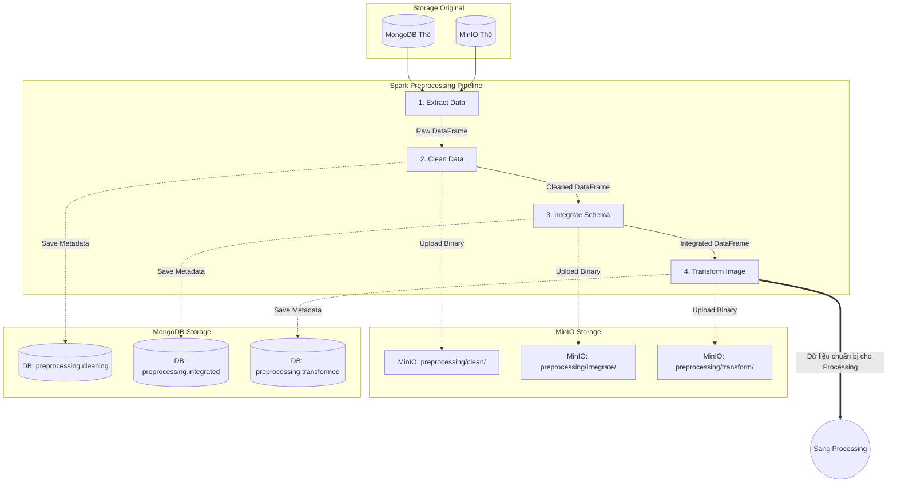

# Data Preprocessing Pipeline

**File thực thi chính:** `data_preprocessing.py`
**Mục tiêu:** Trích xuất dữ liệu thô (raw), làm sạch, chuẩn hóa schema và biến đổi hình ảnh (ví dụ: tẩy trắng nền) nhằm tạo ra tập dữ liệu chất lượng nhất trước khi đưa vào mô hình học máy.

### Logic Hoạt Động (Các Bước)
Toàn bộ pipeline chạy trên PySpark và được tổ chức dưới dạng lazy-evaluation. Pipeline chia làm 4 giai đoạn cụ thể:
1. **Extract (Trích xuất):** 
   - Kéo dữ liệu từ cơ sở dữ liệu MongoDB và ảnh từ MinIO.
   - Sử dụng tham số `limit_rows` và phân vùng (partitioning) để tránh việc dồn khối dữ liệu quá lớn gây bottleneck (nghẽn cổ chai) trên một Worker.
2. **Clean (Làm sạch):** 
   - Chạy các module xử lý dữ liệu lỗi (`cleaning.py`), loại bỏ bản ghi thiếu ảnh hoặc sai định dạng.
   - Hình ảnh nhị phân ở bước này được upload lên MinIO (`preprocessing/clean/<id>.jpg`).
   - Siêu dữ liệu (Metadata) kèm đường dẫn MinIO vừa tạo được lưu tạm vào MongoDB (collection `preprocessing.cleaning`).
3. **Integrate (Tích hợp & Chuẩn hóa):** 
   - Chuyển đổi và gom nhóm (schema) dữ liệu từ nhiều nguồn khác nhau về chung một định dạng chuẩn thông qua `integrate.py`.
   - Kết quả ảnh được đẩy lên MinIO (`preprocessing/integrate/<id>.jpg`).
   - Metadata lưu vào MongoDB (`preprocessing.integrated`).
4. **Transform (Biến đổi hình ảnh):** 
   - Can thiệp trực tiếp vào pixel ảnh (như loại bỏ background nhiễu, chuẩn hoá độ sáng/màu sắc) thông qua `transform.py`. Đây là dữ liệu sạch cuối cùng.
   - Kết quả ảnh được đẩy lên MinIO (`preprocessing/transform/<id>.jpg`).
   - Metadata lưu vào MongoDB (`preprocessing.transformed`).

*Tối ưu Pipeline:* Hàm `df.cache()` được gọi ngay lập tức ở đầu mỗi bước (Action) để lưu trữ (persist) DataFrame hiện tại vào bộ nhớ RAM. Điều này sẽ cắt đứt DAG của Spark, giúp các bước tiếp theo không phải tính toán lại hình ảnh và xử lý dữ liệu từ đầu.

### Sơ Đồ Luồng Hoạt Động (Flowchart)

