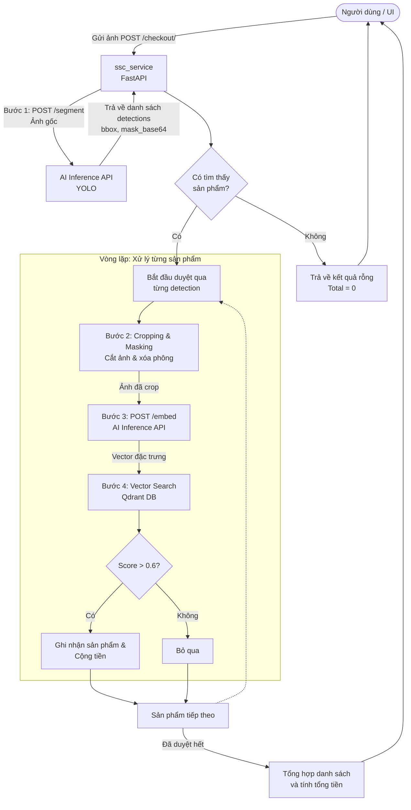

# Smart Checkout Service (ssc_service)

Thư mục này chứa mã nguồn của API Backend (FastAPI) đóng vai trò là cầu nối giữa giao diện người dùng (UI), các mô hình AI (Inference API), và cơ sở dữ liệu vector (Qdrant). 

Dưới đây là sơ đồ luồng hoạt động (Inference Pipeline) chi tiết khi có một yêu cầu thanh toán (checkout) từ người dùng.

## Sơ đồ luồng suy luận (Inference Flow)

Bạn có thể sử dụng đoạn mã Mermaid dưới đây để hiển thị biểu đồ trên các nền tảng hỗ trợ (như GitHub, GitLab, hoặc các công cụ vẽ sơ đồ tương thích với Mermaid):



## Giải thích các bước

1. **Nhận yêu cầu:** Người dùng tải ảnh chụp các sản phẩm lên API `/checkout/`.
2. **Segmentation (Phân vùng ảnh):** `ssc_service` gửi ảnh gốc sang Inference API (`/segment`) để nhận lại các vùng chứa sản phẩm (bounding box) và mask (để tách nền).
3. **Xử lý từng sản phẩm (Vòng lặp):**
   - **Cropping & Masking:** `ssc_service` dựa vào tọa độ và mask để cắt riêng từng sản phẩm ra khỏi ảnh gốc, đồng thời xóa phông nền (để phông trắng) giúp model nhận diện tốt hơn.
   - **Embedding:** Gửi ảnh đã cắt của từng sản phẩm sang Inference API (`/embed`) để trích xuất ra một vector đặc trưng (embedding).
   - **Vector Search:** Sử dụng vector đặc trưng vừa lấy được để tìm kiếm trong cơ sở dữ liệu **Qdrant**. Nếu độ tương đồng vượt quá ngưỡng (threshold > 0.6), sản phẩm đó sẽ được ghi nhận.
4. **Trả kết quả:** Sau khi duyệt qua toàn bộ các bounding box, hệ thống tính tổng tiền và trả về thông tin chi tiết cho người dùng.

## Cấu trúc thư mục hiện tại

- `main.py`: Khởi tạo ứng dụng FastAPI và cấu hình CORS.
- `routers/checkout.py`: Chứa endpoint chính xử lý luồng (pipeline) đã nêu trên.
- `services/inference.py`: Chứa các hàm giao tiếp trực tiếp với Inference API (gọi `/segment` và `/embed`).
- `services/vector_db.py`: Chứa logic kết nối và tìm kiếm với Qdrant.
- `utils/image.py`: Các hàm tiện ích xử lý ảnh (cắt ảnh, áp dụng mask).
- `config.py`: Các biến môi trường và cấu hình hệ thống.

## Hướng dẫn cài đặt và khởi chạy

Dịch vụ này được viết bằng Python và FastAPI. Để khởi chạy `ssc_service` trên môi trường local, bạn thực hiện các bước sau:

**1. Tạo và kích hoạt môi trường ảo (Virtual Environment):**
```bash
# Tạo môi trường ảo
python3 -m venv venv

# Kích hoạt môi trường (trên Linux/macOS)
source venv/bin/activate
```

**2. Cài đặt các thư viện cần thiết:**
```bash
pip install -r requirements.txt
```

**3. Cấu hình biến môi trường:**
Đảm bảo bạn đã cấu hình các biến môi trường cần thiết (hoặc sử dụng file `.env` nếu có) được định nghĩa trong file `config.py` (ví dụ: endpoint của Qdrant, Inference API...).

**4. Khởi chạy Server:**
Sử dụng `uvicorn` để chạy ứng dụng:
```bash
uvicorn main:app --host 0.0.0.0 --port 8000 --reload
```
Tham số `--reload` giúp server tự động khởi động lại khi có thay đổi trong code (rất hữu ích trong quá trình phát triển).

**5. Kiểm tra API Docs:**
Sau khi server đã chạy thành công, bạn có thể truy cập tài liệu API tương tác tự động (Swagger UI) tại trình duyệt:
- **Swagger UI:** [http://localhost:8000/docs](http://localhost:8000/docs)
- **ReDoc:** [http://localhost:8000/redoc](http://localhost:8000/redoc)
